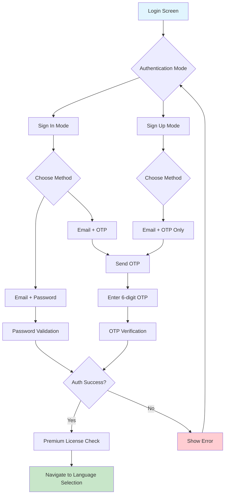

# 🔐 Login Screen Documentation

## Overview
The Login Screen is the primary authentication gateway for the ThoughtPro mental wellness app. It provides multiple authentication methods and manages the initial user onboarding flow.

## 🎯 Screen Purpose
- **Primary Function**: Authenticate users to access the app
- **User Experience**: Flexible authentication options with intuitive interface
- **Data Security**: Secure token-based authentication with rate limiting

---

## 🎨 User Interface & Experience

### Visual Layout
```
┌─────────────────────────────────┐
│     [ThoughtPro Logo]           │
│                                 │
│    "Your Mental Wellness        │
│        Companion"               │
│                                 │
│    ┌─────────────────────┐      │
│    │     Welcome         │      │
│    │ Sign in to access   │      │
│    │ your personalized   │      │
│    │ mental wellness     │      │
│    │    journey          │      │
│    └─────────────────────┘      │
│                                 │
│    [Sign In] [Sign Up]          │
│                                 │
│    [🔗 Use Email]               │
│    [⏭️ Skip for now]           │
│                                 │
│  "By continuing, you agree to   │
│   our Terms and Privacy Policy" │
└─────────────────────────────────┘
```

### Authentication Flow Diagram


---

## 🔧 Authentication Methods

### 1. **Email + Password Authentication**
- **Process**: Traditional email/password combination
- **Validation**: Email format validation + password requirements
- **User Flow**: 
  ```
  Enter Email → Enter Password → Validate → Success/Error
  ```
- **Security**: Secure token storage using AuthService

### 2. **Email + OTP Verification**
- **Process**: Email verification with 6-digit code
- **Rate Limiting**: Built-in cooldown system to prevent spam
- **User Flow**:
  ```
  Enter Email → Send OTP → Enter 6-digit Code → Auto-verify → Success
  ```
- **Features**:
  - ✅ Auto-verification when 6 digits entered
  - ✅ Resend OTP with countdown timer (60 seconds)
  - ✅ Rate limiting protection

### 3. **Google Sign-In** *(Currently Disabled)*
- **Status**: Implemented but commented out in UI
- **Functionality**: Native Google authentication ready for activation

### 4. **Skip Option**
- **Purpose**: Allows temporary app access without authentication
- **Limitation**: Limited functionality until proper authentication

---

## 📱 User Experience Features

### **Dynamic UI States**
| State | Description | Visual Indicator |
|-------|-------------|------------------|
| **Choose Mode** | Initial selection screen | Toggle buttons for Sign In/Sign Up |
| **Email Entry** | Email input for OTP | Email validation in real-time |
| **Password Entry** | Password-based login | Secure text input |
| **OTP Verification** | Code verification | 6-digit numeric input |

### **Interactive Elements**
- **Mode Toggle**: Seamless switching between Sign In ↔ Sign Up
- **Method Toggle**: Switch between Password ↔ OTP verification
- **Loading States**: Activity indicators during authentication
- **Error Handling**: Clear error messages with retry options

### **Accessibility Features**
- ♿ Screen reader support
- 🎯 Clear input labels and placeholders
- 🔄 Loading indicators for all async operations
- ❌ Descriptive error messages

---

## 🔄 Navigation Flow

### **Success Path**
```
Login Screen → Language Selection → Privacy Notice → Welcome → Self Onboarding → Main App
```

### **Conditional Navigation**
The navigation logic checks several conditions:

1. **First-time User**: `hasCompletedOnboarding = null`
   - Path: Login → Language → Privacy → Welcome → Self Assessment

2. **Returning User**: `hasCompletedOnboarding = true`
   - Path: Login → Language → Main App *(if assessment completed)*
   - Path: Login → Language → Self Assessment *(if assessment pending)*

3. **Premium User**: Auto-detection and activation
   - Shows welcome message with subscription details
   - Activates premium features automatically

---

## 🎛️ Key Functionalities

### **Authentication States**
- **Loading**: Shows spinner during network operations
- **Error**: Displays user-friendly error messages
- **Success**: Immediate navigation to next screen

### **Data Management**
- **Token Storage**: Secure token persistence using AuthService
- **User Session**: Temporary session creation for consistency
- **Premium Status**: Automatic license validation and activation

### **Security Features**
- **Rate Limiting**: Prevents OTP spam requests
- **Input Validation**: Email format and required field validation
- **Error Handling**: Network error recovery and user feedback
- **Token Security**: Secure storage of authentication tokens

---

## 📊 Technical Implementation

### **Core Services Used**
- `AuthService`: Main authentication logic
- `GoogleAuthNative`: Google sign-in functionality
- `LicenseService`: Premium subscription validation
- `AsyncStorage`: Local data persistence

### **State Management**
```javascript
// Key state variables managed:
- mode: "choose" | "email" | "password" | "otp"
- authMode: "signin" | "signup"
- loading states for each operation
- form data (email, password, otp)
- timer and cooldown management
```

### **Premium Integration**
- Automatic license checking post-authentication
- Premium status activation
- Subscription details display
- Feature unlocking

---

## 🎯 Success Metrics

### **User Experience Goals**
- ✅ **Quick Authentication**: Multiple fast options available
- ✅ **Error Recovery**: Clear paths to resolve issues
- ✅ **Accessibility**: Support for all users
- ✅ **Security**: Protected against common attacks

### **Technical Performance**
- ⚡ **Fast Loading**: Optimized authentication flows
- 🔒 **Secure**: Token-based authentication
- 📱 **Responsive**: Works across different screen sizes
- 🔄 **Reliable**: Robust error handling and recovery

---

## 🔗 Next Steps
After successful authentication, users proceed to:
- **[Language Selection Screen](02_LANGUAGE_SELECTION_DOCUMENTATION.md)** for localization setup
