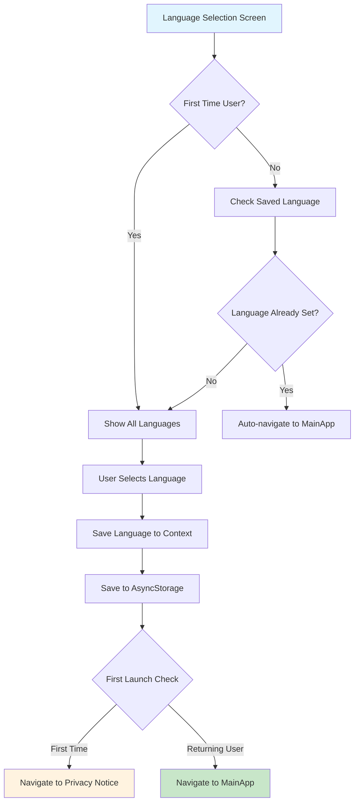
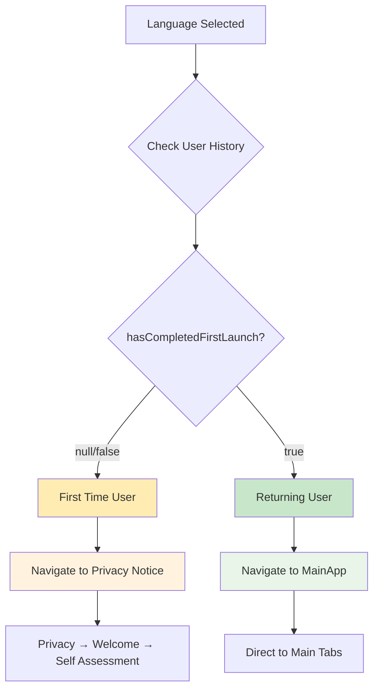

# 🌍 Language Selection Screen Documentation

## Overview
The Language Selection Screen enables users to choose their preferred language for the ThoughtPro app interface. This screen supports multiple languages and integrates with the app's internationalization system.

## 🎯 Screen Purpose
- **Primary Function**: Allow users to select their preferred language
- **User Experience**: Simple, intuitive language selection interface
- **Localization**: Enable full app experience in user's native language

---

## 🎨 User Interface & Experience

### Visual Layout
```
┌─────────────────────────────────┐
│                                 │
│    Please select your language  │
│                                 │
│    ┌─────────────────────┐      │
│    │      English        │      │
│    │       🇺🇸           │      │
│    └─────────────────────┘      │
│                                 │
│    ┌─────────────────────┐      │
│    │       हिंदी         │      │
│    │       🇮🇳           │      │
│    └─────────────────────┘      │
│                                 │
│    ┌─────────────────────┐      │
│    │       मराठी         │      │
│    │       🇮🇳           │      │
│    └─────────────────────┘      │
│                                 │
│        [Loading...]             │
│                                 │
└─────────────────────────────────┘
```

### Language Selection Flow


---

## 🌐 Supported Languages

### **Available Languages**
| Language Code | Language Name | Native Script | Region |
|---------------|---------------|---------------|--------|
| `en` | English | English | Global |
| `hi` | Hindi | हिंदी | India |
| `mr` | Marathi | मराठी | Maharashtra, India |

### **Language Features**
- **✅ Complete Translation**: All app text translated
- **✅ RTL Support**: Ready for future right-to-left languages
- **✅ Cultural Adaptation**: Culturally appropriate content
- **✅ Dynamic Loading**: Languages loaded on demand

---

## 🔄 Navigation Logic

### **Smart Navigation System**
The screen intelligently determines the next destination based on user state:



### **Navigation Conditions**
1. **First-Time User Flow**:
   - Language Selection → Privacy Notice → Welcome → Self Assessment → Main App

2. **Returning User Flow**:
   - Language Selection → Main App *(direct access)*

3. **Language Change Flow**:
   - Settings → Language Selection → Main App *(maintains current position)*

---

## 🎛️ Key Functionalities

### **Language Management**
- **Context Integration**: Uses `LanguageContext` for global state
- **Persistence**: Saves selection to `AsyncStorage` with key `'selectedLanguage'`
- **Real-time Updates**: Immediate UI language change
- **Fallback System**: Defaults to English if language fails to load

### **Loading States**
| State | Description | User Experience |
|-------|-------------|-----------------|
| **Initial Loading** | Checking existing language | Loading spinner with "Loading..." |
| **Language Changing** | Applying new language | Loading spinner with "Changing language..." |
| **Navigation** | Moving to next screen | Brief loading before navigation |

### **Error Handling**
- **Network Issues**: Graceful fallback to cached languages
- **Storage Errors**: Alert with retry option
- **Invalid Language**: Automatic fallback to English
- **User Feedback**: Clear error messages in current language

---

## 📱 User Experience Features

### **Accessibility Features**
- ♿ **Screen Reader**: Full screen reader support for language names
- 🎯 **Touch Targets**: Large, easy-to-tap language buttons
- 🔤 **Native Scripts**: Language names displayed in native scripts
- ⚡ **Quick Selection**: Single-tap selection with immediate feedback

### **Visual Design**
- **Clean Layout**: Minimalist design focusing on language choices
- **Native Typography**: Proper font support for each language
- **Loading Indicators**: Clear feedback during language changes
- **Responsive Design**: Adapts to different screen sizes

### **Interaction Flow**
```
User Opens Screen → See Available Languages → Tap Language → 
Loading State → Language Applied → Navigate to Next Screen
```

---

## 🔧 Technical Implementation

### **Language Storage Strategy**
- **Primary Storage**: `LanguageContext` for runtime state
- **Persistence**: `AsyncStorage` for app restart persistence
- **Key Used**: `'selectedLanguage'` *(consistent across app)*

### **Context Integration**
```typescript
// Core functionality provided by LanguageContext:
- setLocale(languageCode): Changes app language
- supportedLanguages: Available language options
- isLoading: Loading state management
- t(): Translation function
```

### **Conditional Navigation Logic**
```typescript
// Navigation decision tree:
if (hasCompletedFirstLaunch === null) {
  // First time user
  navigate("PrivacyNoticeScreen")
} else {
  // Returning user
  navigate("MainApp")
}
```

---

## 🔄 Integration Points

### **Previous Screen**: 
- **[Login Screen](01_LOGIN_SCREEN_DOCUMENTATION.md)** → Language Selection

### **Next Screens**:
- **First-time Users**: Language Selection → **[Privacy Notice](03_PRIVACY_NOTICE_DOCUMENTATION.md)**
- **Returning Users**: Language Selection → Main App

### **Related Features**:
- **Settings Integration**: Can be accessed from Profile settings
- **Real-time Translation**: All app text updates immediately
- **Onboarding Flow**: Integrated with overall user onboarding

---

## 🎯 Success Metrics

### **User Experience Goals**
- ✅ **Quick Selection**: Fast, one-tap language selection
- ✅ **Native Feel**: Content feels natural in selected language
- ✅ **Persistent Choice**: Language remembered across app sessions
- ✅ **Easy Changes**: Can modify language from settings later

### **Technical Performance**
- ⚡ **Fast Loading**: Instant language switching
- 💾 **Reliable Storage**: Persistent language preferences
- 🔄 **Smooth Navigation**: Seamless transition to next screen
- 🌐 **Complete Coverage**: All text properly translated

---

## 🚀 Future Enhancements

### **Planned Features**
- 🌍 **Additional Languages**: Support for more regional languages
- 🎵 **Audio Support**: Pronunciation guides for language names
- 🎨 **Regional Themes**: Cultural themes based on language selection
- 📱 **Auto-Detection**: Device language detection for default selection

---

## 🔗 Related Documentation
- **Previous**: [Login Screen Documentation](01_LOGIN_SCREEN_DOCUMENTATION.md)
- **Next**: [Privacy Notice Documentation](03_PRIVACY_NOTICE_DOCUMENTATION.md)
- **See Also**: Settings > Language Configuration
