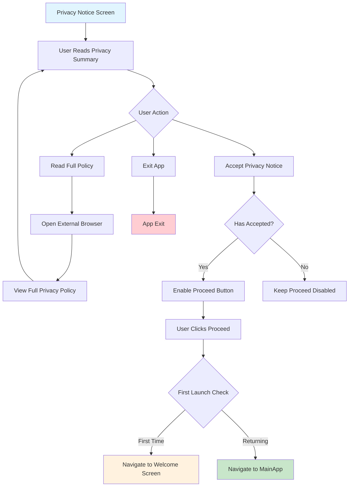

# 🛡️ Privacy Notice Screen Documentation

## Overview
The Privacy Notice Screen provides users with a clear, concise summary of ThoughtPro's privacy practices. It emphasizes local data storage and user privacy protection while requiring explicit consent before proceeding.

## 🎯 Screen Purpose
- **Primary Function**: Inform users about data privacy practices
- **Legal Compliance**: Obtain explicit user consent for data handling
- **Trust Building**: Demonstrate commitment to user privacy and data security
- **User Education**: Explain local-first data storage approach

---

## 🎨 User Interface & Experience

### Visual Layout
```
┌─────────────────────────────────┐
│        🛡️ Privacy TLDR          │
│                                 │
│   ┌─────────────────────────┐   │
│   │  All your personal data │   │
│   │  including mood entries,│   │
│   │  journal entries, and   │   │
│   │  assessments are stored │   │
│   │  locally on your device │   │
│   └─────────────────────────┘   │
│                                 │
│   📱 Local storage on device    │
│   🛡️ End-to-end encryption      │
│   ☁️ Works completely offline   │
│   🔒 No tracking or analytics   │
│   💳 Only subscription details  │
│      stored on secure servers   │
│                                 │
│   [📄 Read Full Privacy Policy] │
│                                 │
│   [✅ I Accept]                 │
│                                 │
│   [➡️ Proceed]                  │
└─────────────────────────────────┘
```

### Privacy Consent Flow


---

## 🔒 Privacy Principles Highlighted

### **Core Privacy Features**
| Feature | Description | User Benefit |
|---------|-------------|--------------|
| **📱 Local Storage** | All personal data stored on device | Complete data ownership |
| **🛡️ Encryption** | End-to-end encryption for sensitive data | Maximum security |
| **☁️ Offline-First** | Works without internet connection | No data transmission required |
| **🔒 No Tracking** | Zero analytics or user tracking | Complete privacy |
| **💳 Minimal Server Data** | Only subscription info on servers | Minimal data exposure |

### **Data Categories Explained**

#### **Stored Locally (Never Leaves Device)**
- 📝 **Mood entries and journal entries**
- 📊 **Mental health assessment results**
- 📱 **App usage patterns and preferences**
- 🎯 **Personalized recommendations**
- ⚙️ **User settings and configurations**

#### **Stored on Secure Servers (Minimal)**
- 🔐 **Subscription and payment details**
- 👤 **Basic account information (email)**
- 🎫 **License validation data**

---

## 🎛️ Key Functionalities

### **Interactive Elements**

#### **1. Privacy Policy Link**
- **Function**: Opens full privacy policy in external browser
- **URL**: `https://thoughthealer.org/terms&condition.html`
- **Visual**: Purple button with document icon and external link indicator
- **Behavior**: Non-blocking action, user can return to app

#### **2. Accept Button**
- **Initial State**: Inactive (gray with outline icon)
- **Active State**: Green background with filled checkmark
- **Function**: Records user consent
- **Validation**: Required before proceeding

#### **3. Proceed Button**
- **Disabled State**: Gray background, disabled text
- **Enabled State**: Purple gradient with white text
- **Dependency**: Only enabled after acceptance
- **Action**: Navigates to next screen based on user history

### **State Management**
```mermaid
stateDiagram-v2
    [*] --> NotAccepted
    
    NotAccepted --> Accepted : User clicks "I Accept"
    NotAccepted --> ReadingPolicy : User clicks "Read Full Policy"
    
    ReadingPolicy --> NotAccepted : Returns from browser
    
    Accepted --> Proceeding : User clicks "Proceed"
    
    Proceeding --> WelcomeScreen : First time user
    Proceeding --> MainApp : Returning user
    
    state NotAccepted {
        AcceptButton : Gray/Inactive
        ProceedButton : Disabled
    }
    
    state Accepted {
        AcceptButton : Green/Active
        ProceedButton : Enabled
    }
```

---

## 🔄 Navigation Logic

### **Smart Navigation System**
The screen determines the next destination based on user history:

```typescript
// Navigation decision logic:
const hasCompletedFirstLaunch = await AsyncStorage.getItem('hasCompletedFirstLaunch');

if (hasCompletedFirstLaunch === null) {
  // First time user → Welcome Screen
  navigation.navigate('WelcomeScreen');
} else {
  // Returning user → Main App
  navigation.navigate('MainApp');
}
```

### **Navigation Paths**
1. **First-Time User Journey**:
   ```
   Privacy Notice → Welcome Screen → Self Onboarding → Main App
   ```

2. **Returning User Journey**:
   ```
   Privacy Notice → Main App (Direct Access)
   ```

3. **External Link Journey**:
   ```
   Privacy Notice → External Browser → Privacy Notice (Return)
   ```

---

## 📱 User Experience Features

### **Visual Design Elements**
- **🎨 Clean Layout**: Minimalist design focusing on content
- **🛡️ Trust Indicators**: Shield icon and security-focused iconography
- **📱 Mobile-Optimized**: Responsive design for all screen sizes
- **♿ Accessibility**: Screen reader support and high contrast

### **Micro-Interactions**
- **Button States**: Visual feedback for all interactive elements
- **Loading States**: Smooth transitions between screens
- **External Links**: Clear indication of external navigation
- **Acceptance Flow**: Progressive disclosure of actions

### **Content Strategy**
- **📋 TLDR Format**: Concise summary instead of legal jargon
- **🎯 Key Points**: Bullet points highlighting main privacy features
- **🔗 Full Details**: Link to comprehensive privacy policy
- **✅ Clear Action**: Explicit consent mechanism

---

## 🔧 Technical Implementation

### **Core Components Used**
- `SafeAreaView`: Screen layout container
- `ScrollView`: Scrollable content area
- `TouchableOpacity`: Interactive buttons
- `CustomIcon`: Consistent iconography
- `Linking`: External URL handling

### **State Variables**
```typescript
const [hasAccepted, setHasAccepted] = useState(false);
// Controls button states and navigation availability
```

### **External Integration**
- **Privacy Policy URL**: Links to hosted privacy policy
- **AsyncStorage**: Checks user history for navigation
- **Navigation**: Context-aware routing to next screen

---

## 🎯 Success Metrics

### **User Experience Goals**
- ✅ **Clear Communication**: Users understand privacy practices
- ✅ **Trust Building**: Transparent data handling builds confidence
- ✅ **Informed Consent**: Users make conscious privacy decisions
- ✅ **Smooth Flow**: No friction in the onboarding process

### **Compliance Goals**
- ✅ **Legal Requirements**: Meets privacy regulation requirements
- ✅ **Explicit Consent**: Clear acceptance mechanism
- ✅ **Accessibility**: Available to all users
- ✅ **Documentation**: Full privacy policy readily accessible

---

## 🚀 Privacy-by-Design Features

### **Technical Privacy Implementation**
- **🔐 Local Database**: SQLite storage on device
- **🔄 No Cloud Sync**: Mental health data never transmitted
- **🛡️ Encryption**: Sensitive data encrypted at rest
- **📵 Offline Capability**: Full functionality without internet

### **User Control Mechanisms**
- **🗑️ Data Deletion**: Users can delete all local data
- **⚙️ Privacy Settings**: Granular control over data collection
- **📤 Export Options**: Users can export their data
- **🔒 No Backdoors**: No remote access to user data

---

## 🔗 Integration Points

### **Previous Screen**: 
- **[Language Selection](02_LANGUAGE_SELECTION_DOCUMENTATION.md)** → Privacy Notice

### **Next Screens**:
- **First-time Users**: Privacy Notice → Welcome Screen → **[Self Onboarding](04_SELF_ONBOARDING_DOCUMENTATION.md)**
- **Returning Users**: Privacy Notice → Main App

### **External Links**:
- **Full Privacy Policy**: External browser with complete legal documentation

---

## 🎨 Design Patterns

### **Trust-Building Elements**
- **🎨 Calm Colors**: Blue and green color scheme for trust
- **🛡️ Security Icons**: Visual representation of protection
- **📝 Clear Language**: Non-technical privacy explanation
- **✅ Progressive Disclosure**: Information revealed in digestible chunks

### **Accessibility Features**
- **♿ Screen Reader**: Full VoiceOver/TalkBack support
- **🎯 Touch Targets**: Minimum 44px touch targets
- **🔤 Font Scaling**: Respects system font size settings
- **🎨 Color Contrast**: WCAG compliant color combinations

---

## 🔗 Related Documentation
- **Previous**: [Language Selection Documentation](02_LANGUAGE_SELECTION_DOCUMENTATION.md)
- **Next**: [Self Onboarding Documentation](04_SELF_ONBOARDING_DOCUMENTATION.md)
- **See Also**: Full Privacy Policy (External Link)
