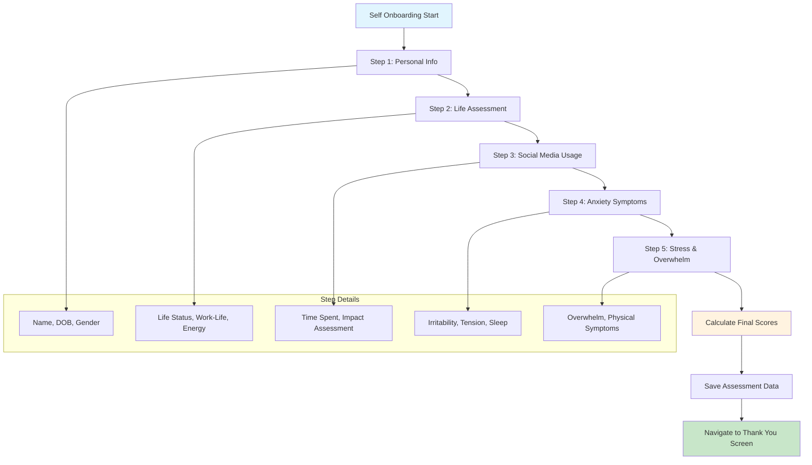
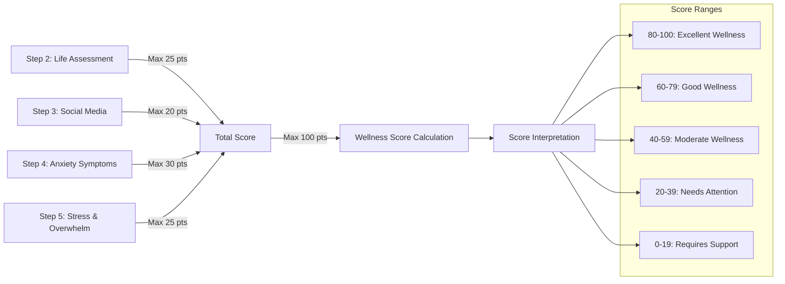
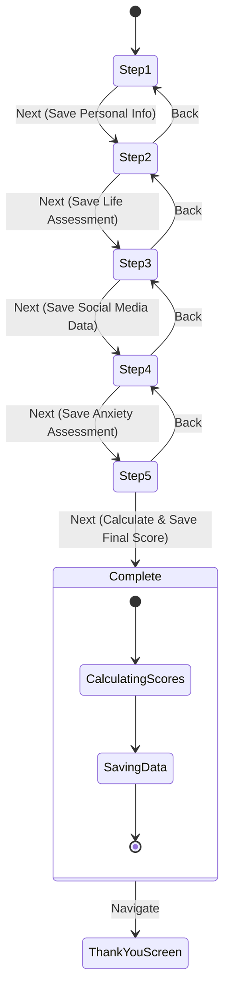
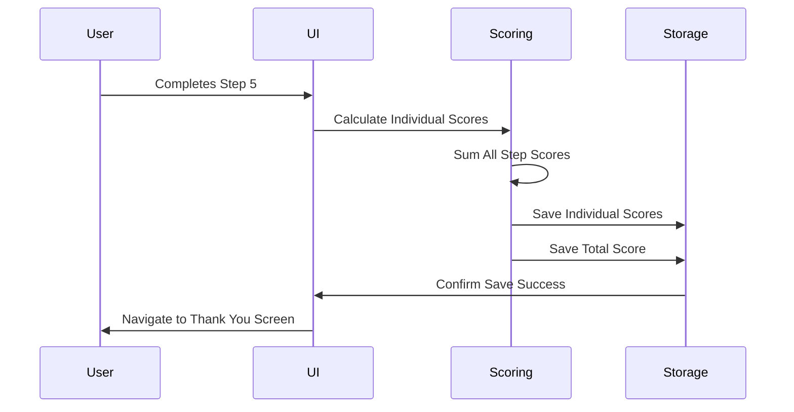

# 📋 Self Onboarding Documentation

## Overview
The Self Onboarding screen is a comprehensive 5-step assessment that collects user personal information, mental health baseline data, and generates an initial wellness score. This forms the foundation for personalized mental health recommendations throughout the app.

## 🎯 Screen Purpose
- **Primary Function**: Collect baseline mental health assessment data
- **Personalization**: Create user profile for tailored recommendations
- **Wellness Scoring**: Generate initial mental health scores
- **User Journey**: Complete the onboarding process to access main app features

---

## 🎨 User Interface & Experience

### Visual Layout Flow
```
┌─────────────────────────────────┐
│    Step 1 of 5                  │
│    ████████░░░░░░░░░░░░░░░       │
│                                 │
│    Let's get to know you!!      │
│                                 │
│    What should we call you?     │
│    [___________________]        │
│                                 │
│    What is your DOB?            │
│    [📅 Date Picker]             │
│                                 │
│    What gender do you           │
│    identify with?               │
│    ○ Male     ○ Female          │
│    ○ Non-binary                 │
│    ○ Prefer not to say          │
│    ○ Other                      │
│                                 │
│    [← Back]        [Next →]     │
└─────────────────────────────────┘
```

### Complete Assessment Flow


---

## 📝 Assessment Steps Breakdown

### **Step 1: Personal Information**
| Field | Type | Purpose | Validation |
|-------|------|---------|------------|
| **Name** | Text Input | Personalization | Optional |
| **Date of Birth** | Date Picker | Age-appropriate content | Required |
| **Gender** | Radio Buttons | Inclusive profiling | 5 Options Available |

#### Gender Options:
- ✅ Male
- ✅ Female  
- ✅ Non-binary
- ✅ Prefer not to say
- ✅ Other (with specify option)

---

### **Step 2: Life Assessment**
#### Questions & Scoring (10-point scale):

| **Question** | **Response Options** | **Scoring** |
|--------------|---------------------|-------------|
| How is life going for you? | Going smoothly (10)<br>Mostly okay (7)<br>Feeling a bit off (4)<br>Difficult (0) | Life Status Score |
| How manageable is your work-life balance? | Very manageable (10)<br>Somewhat manageable (7)<br>A bit overwhelming (4)<br>Very overwhelming (0) | Work-Life Score |
| How are you feeling energy-wise? | Refreshed (5)<br>A bit burnt out (0) | Energy Score |

**Total Step 2 Score**: Life Status + Work-Life + Energy (Max: 25 points)

---

### **Step 3: Social Media Assessment**
#### Digital Wellness Evaluation:

| **Question** | **Response Options** | **Scoring** |
|--------------|---------------------|-------------|
| Daily social media time? | Less than 1 hour (10)<br>1-3 hours (7)<br>3-5 hours (4)<br>5+ hours (0) | Usage Score |
| Social media's effect on you? | Positive (10)<br>Neutral (7)<br>Sometimes negative (4)<br>Often negative (0) | Impact Score |

**Total Step 3 Score**: Usage + Impact (Max: 20 points)

---

### **Step 4: Anxiety Symptoms Assessment**
#### Clinical Symptom Evaluation (5-point Likert scale):

| **Symptom** | **Scale** | **Scoring** |
|-------------|-----------|-------------|
| Irritability frequency | Very Unlikely (10) → Very Likely (0) | Irritability Score |
| Muscle tension | Very Unlikely (10) → Very Likely (0) | Tension Score |
| Sleep difficulties due to anxiety | Very Unlikely (10) → Very Likely (0) | Sleep Score |

**Total Step 4 Score**: Irritability + Tension + Sleep (Max: 30 points)

---

### **Step 5: Stress & Overwhelm Assessment**
#### Advanced Stress Indicators:

| **Question** | **Scale** | **Scoring** |
|--------------|-----------|-------------|
| Feeling overwhelmed | Very Unlikely (15) → Very Likely (0) | Overwhelm Score |
| Physical stress symptoms | Very Unlikely (10) → Very Likely (0) | Physical Score |

**Total Step 5 Score**: Overwhelm + Physical (Max: 25 points)

---

## 📊 Scoring System

### **Comprehensive Scoring Algorithm**


### **Individual Step Scoring**
```javascript
// Scoring calculation example:
const self2Score = lifeStatusScore + workLifeScore + energyScore;
const self3Score = socialMediaTimeScore + socialMediaEffectScore;
const self4Score = irritabilityScore + tensionScore + sleepScore;
const self5Score = overwhelmScore + physicalSymptomsScore;

const totalOnboardingScore = self2Score + self3Score + self4Score + self5Score;
```

---

## 🎛️ Key Functionalities

### **Navigation Features**
- **📊 Progress Bar**: Visual indicator showing completion progress (1-5 steps)
- **⬅️ Back Button**: Navigate to previous step (preserves data)
- **➡️ Next Button**: Advance to next step (validates current step)
- **⏭️ Skip Options**: Allow skipping non-critical questions

### **Data Persistence**
- **💾 Auto-Save**: Data saved after each step completion
- **🔄 Resume Capability**: Can resume from any step if interrupted
- **📱 Local Storage**: All data stored in AsyncStorage
- **🔐 Secure Storage**: Sensitive data encrypted

### **User Experience Features**
| Feature | Description | Benefit |
|---------|-------------|---------|
| **Real-time Validation** | Instant feedback on inputs | Prevents errors |
| **Progress Tracking** | Visual progress bar | Reduces abandonment |
| **Data Persistence** | Saves progress between sessions | User convenience |
| **Accessible Design** | Screen reader support | Inclusive experience |

---

## 📱 Interactive Elements

### **Input Components**
- **📝 Text Input**: Name entry with placeholder text
- **📅 Date Picker**: Native date selection widget
- **🔘 Radio Buttons**: Single-selection option groups
- **📊 Likert Scales**: 5-point rating scales for assessments

### **Button States**


---

## 💾 Data Storage Strategy

### **Storage Locations**
| Data Type | Storage Method | Purpose |
|-----------|---------------|---------|
| **Personal Info** | `AsyncStorage: "Self1"` | Profile creation |
| **Assessment Responses** | `AsyncStorage: "onboardingResponses"` | Score calculation |
| **Individual Scores** | Within assessment responses | Progress tracking |
| **Final Score** | `overallOnboardingScore` key | Wellness baseline |

### **Data Structure Example**
```json
{
  "onboardingResponses": {
    "lifeStatusKey": "self2.mostlyOkay",
    "workLifeKey": "self2.somewhatManageable",
    "self2Score": 19,
    "socialMediaTimeKey": "self3.oneToThreeHours",
    "self3Score": 14,
    "screen6": {
      "irritabilityKey": "self4Screen.unlikely",
      "muscleTensionKey": "self4Screen.neutral"
    },
    "self4Score": 21,
    "overallOnboardingScore": 67
  }
}
```

---

## 🔄 Assessment Completion Flow

### **Step Validation Rules**
1. **Step 1**: Name (optional), DOB (required), Gender (required)
2. **Step 2**: All three life assessment questions (required)
3. **Step 3**: Both social media questions (required)
4. **Step 4**: All three anxiety symptom ratings (required)
5. **Step 5**: Both stress assessment questions (required)

### **Score Calculation Process**


---

## 🎯 Success Metrics

### **Assessment Quality Goals**
- ✅ **Complete Data Collection**: All critical wellness indicators captured
- ✅ **Accurate Scoring**: Reliable baseline wellness measurement
- ✅ **User Engagement**: High completion rate across all steps
- ✅ **Data Persistence**: No data loss during assessment

### **User Experience Goals**
- ✅ **Intuitive Flow**: Clear progression through assessment
- ✅ **Flexible Navigation**: Easy to go back and modify responses
- ✅ **Accessible Design**: Usable by all users
- ✅ **Privacy Assurance**: Data stays local on device

---

## 🔗 Integration Points

### **Previous Screen**: 
- **[Privacy Notice](03_PRIVACY_NOTICE_DOCUMENTATION.md)** → Self Onboarding

### **Next Screen**:
- Self Onboarding → **Self Thank You Screen** → Main App

### **Data Usage**:
- **Wellness Score**: Used throughout app for personalized recommendations
- **Personal Info**: Creates user profile for app personalization
- **Assessment Data**: Baseline for tracking mental health progress

---

## 🚀 Personalization Outcomes

### **Generated User Profile**
- **📊 Baseline Wellness Score**: Initial mental health measurement
- **👤 Personal Preferences**: Name, age group, gender identity
- **🎯 Risk Factors**: Areas needing attention based on responses
- **💡 Recommendation Engine**: Personalized intervention suggestions

### **App Customization Based on Assessment**
- **🏠 Home Screen**: Tailored daily tips and recommendations
- **🧠 Mind Tools**: Prioritized tools based on identified needs
- **📈 Insights**: Relevant tracking metrics highlighted
- **🎨 Content Adaptation**: Age and culturally appropriate content

---

## 🔗 Related Documentation
- **Previous**: [Privacy Notice Documentation](03_PRIVACY_NOTICE_DOCUMENTATION.md)
- **Next**: Self Thank You Screen → Main App Documentation
- **See Also**: Wellness Score Algorithm, Profile Management
