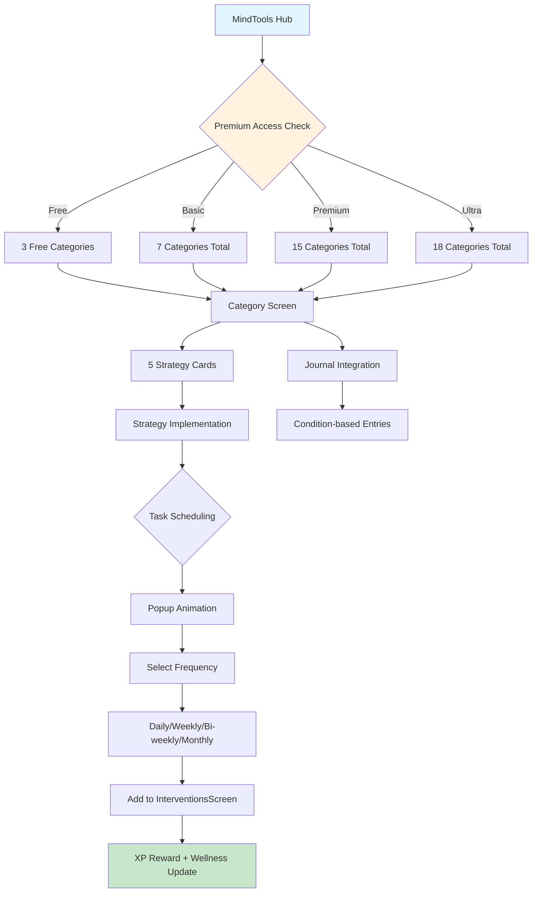
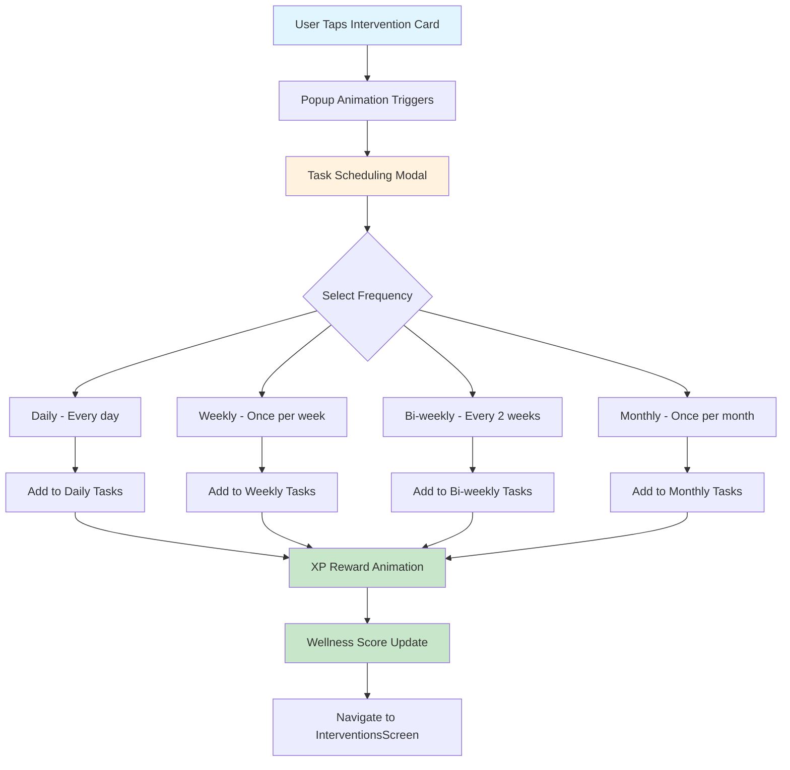
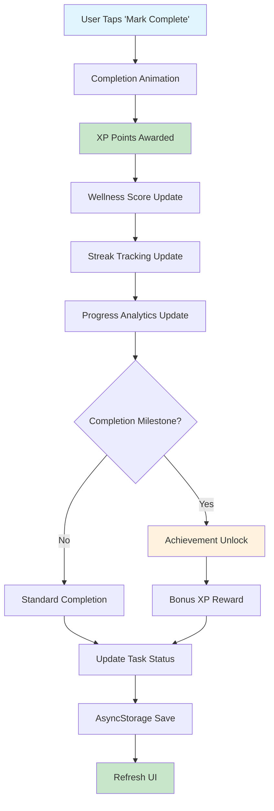
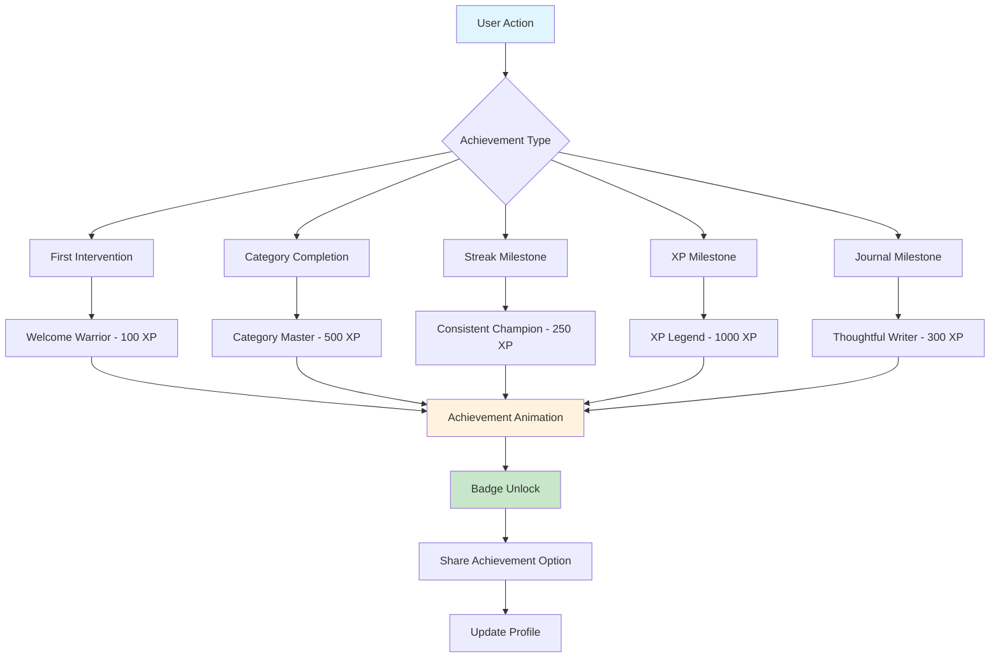
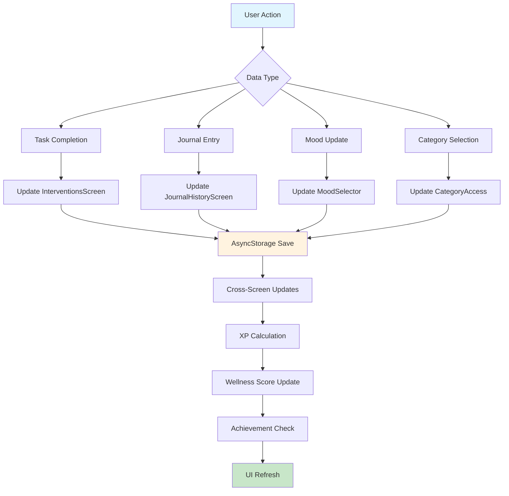
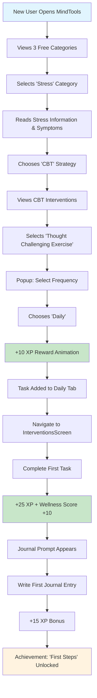
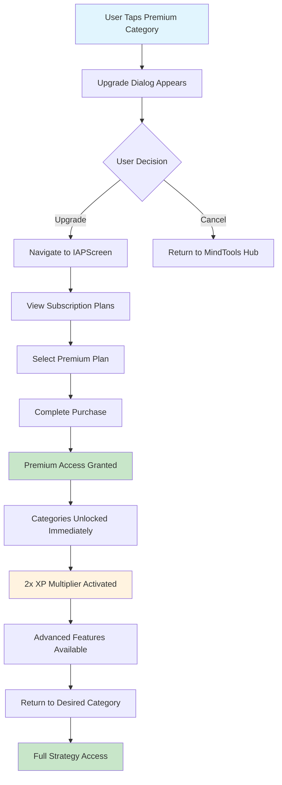
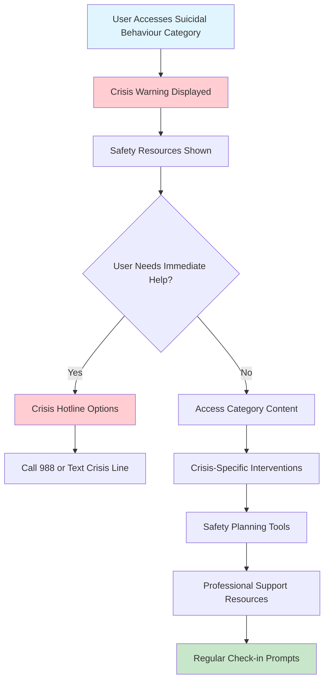

# 🧠 MindTools Screen - Complete Documentation

## 📋 Overview

The MindTools Screen serves as the **central mental health intervention hub** for ThoughtPro, providing comprehensive access to:
- **18 Mental Health Categories** - Organized by subscription tiers
- **5 Strategy Types per Category** - CBT, REBT, Yoga, Relaxation, Common Suggestions  
- **Advanced Task Management** - Daily/Weekly/Bi-weekly/Monthly scheduling
- **Journal Integration** - Condition-based personal reflection system
- **XP & Wellness Tracking** - Gamified progress and wellness scoring

## � Core Architecture

### Component Structure
```typescript
interface MindToolsEcosystem {
  mainHub: "MindToolsScreen.tsx";           // 1070 lines - Central navigation
  categoryScreens: 18;                     // Individual condition screens
  strategyScreens: 5;                      // CBT, REBT, Yoga, Relaxation, Common
  taskManagement: "InterventionsScreen.tsx"; // 2481 lines - Task system
  journaling: "JournalHistoryScreen.tsx";   // 693 lines - Personal journals
  premiumControl: "PremiumAccessGating";    // Subscription enforcement
}
```

### Navigation Flow Architecture


---

## 🏠 Main MindTools Hub Screen

### Visual Layout
```
┌─────────────────────────────────────┐
│ [☰] MindTools            [👤]      │ ← Header with Mood Selector
├─────────────────────────────────────┤
│ 📋 Assigned Tasks                   │
├─────────────────────────────────────┤
│ 📅 Daily Tasks    📊 Total Tasks    │ ← Task Overview Cards
│ [📝 3 to complete] [📈 8 in progress] │
│ 👁 View           👁 View          │
├─────────────────────────────────────┤
│ 📔 View Journal History             │ ← Journal Access
│ Journal your thoughts for better    │
│ treatment           👁 View         │
├─────────────────────────────────────┤
│ 🧠 Mental Health Conditions         │ ← Category Grid
│                                     │
│ [😡 Anger] [😰 Stress] [📱 Internet] │ ← FREE Categories
│                                     │
│ [👥 Family] [😴 Sleep] [🆘 Crisis]   │ ← BASIC Categories  
│                                     │
│ [🚫 Addictions] [🧠 Psychology]      │ ← PREMIUM Categories
│                                     │
│ [💰 Financial] [💪 Fitness] [📺 Media] │
│                                     │
│ [🏢 Professional] [👨‍👩‍👧‍👦 Social] [⚠️ Job] │ ← ULTRA Categories
│                                     │
│ [👶 Youth] [🧠 EQ]                   │
└─────────────────────────────────────┘
```

### Key Components Breakdown

#### 1. **Task Overview Section**
```typescript
interface TaskOverviewCards {
  dailyTasks: {
    count: number;                    // Pending daily interventions
    navigation: "InterventionsScreen(Daily)";
    icon: "happy-outline";           // Ionicon
    loading: boolean;                // Loading state management
    translation: "dailyTasksTitle";  // i18n key
  };
  totalInterventions: {
    count: number;                   // All active interventions
    navigation: "InterventionsScreen(All)";
    icon: "calendar-outline";        // Ionicon  
    loading: boolean;                // Loading state management
    translation: "totalInterventionsTitle"; // i18n key
  };
}
```

#### 2. **Journal History Card**
```typescript
interface JournalCard {
  navigation: "JournalHistoryScreen";
  title: "View journal history";
  subtitle: "Journal your thoughts for better treatment";
  icon: "journal-outline";          // Ionicon
  description: "View all journal history here";
  integration: "condition-based entries"; // Links to categories
}
```

#### 3. **Mental Health Categories Grid**
```typescript
interface CategoryAccessMap {
  free: ["Anger Management", "Stress", "Internet & Social Media"];
  basic: ["Family & Relationship", "Sleep", "Suicidal Behaviour", "Sex Life"];
  premium: [
    "Addictions", "Common Psychological", "Environment Issues",
    "Financial Mental Health", "Physical Fitness", "Internet Dependence", 
    "Professional Mental Health", "Social Mental Health"
  ];
  ultra: ["Job Insecurity", "Youngster Issues", "Emotional Intelligence"];
}
```

---

## 🎯 18 Mental Health Categories - Complete Breakdown

### **FREE Tier Categories (3 total)**

#### 1. **😡 Anger Management**
```typescript
interface AngerManagementCategory {
  icon: "flame-outline";
  accessLevel: "free";
  navigation: "AngerManagementScreen";
  symptoms: [
    "Frequent irritability and quick temper",
    "Physical aggression or verbal outbursts", 
    "Difficulty calming down after anger episodes",
    "Relationship conflicts due to anger",
    "Feeling regret after anger episodes"
  ];
  strategies: 5; // CBT, REBT, Yoga, Relaxation, Common Suggestions
}
```

#### 2. **😰 Stress**  
```typescript
interface StressCategory {
  icon: "alert-circle-outline";
  accessLevel: "free";
  navigation: "StressScreen";
  description: "Stress management and coping strategies";
  focus: "workplace stress, life pressures, anxiety management";
  strategies: 5; // All 5 intervention types available
}
```

#### 3. **📱 Internet & Social Media**
```typescript
interface InternetSocialMediaCategory {
  icon: "phone-portrait-outline";
  accessLevel: "free"; 
  navigation: "InternetSocialMediaScreen";
  description: "Digital wellness and screen time management";
  focus: "social media addiction, digital detox, healthy usage";
  strategies: 5; // All 5 intervention types available
}
```

### **BASIC Tier Categories (4 additional)**

#### 4. **👥 Family & Relationship**
```typescript
interface FamilyRelationshipCategory {
  icon: "people-outline";
  accessLevel: "basic";
  navigation: "FamilyRelationshipScreen";
  description: "Relationship counseling and family dynamics";
  focus: "communication skills, conflict resolution, intimacy";
  upgradeDialog: "Premium Plan Required";
}
```

#### 5. **😴 Sleep**
```typescript
interface SleepCategory {
  icon: "moon-outline";
  accessLevel: "basic";
  navigation: "SleepScreen";
  description: "Sleep hygiene and insomnia support";
  focus: "sleep disorders, sleep quality, bedtime routines";
  upgradeDialog: "Premium Plan Required";
}
```

#### 6. **🆘 Suicidal Behaviour** ⚠️ **Crisis Support**
```typescript
interface SuicidalBehaviourCategory {
  icon: "medical-outline";
  accessLevel: "basic";
  navigation: "SuicidalBehaviourScreen";
  description: "Crisis intervention and support resources";
  specialFeatures: {
    professionalAlerts: true;
    crisisHotlines: true;
    emergencyContacts: true;
    safetyPlanning: true;
  };
  focus: "crisis intervention, safety planning, professional support";
}
```

#### 7. **❤️ Sex Life**
```typescript
interface SexLifeCategory {
  icon: "heart-outline";
  accessLevel: "basic";
  navigation: "SexLifeScreen"; 
  description: "Sexual health and intimate relationship guidance";
  focus: "intimacy issues, sexual dysfunction, relationship counseling";
  upgradeDialog: "Premium Plan Required";
}
```

### **PREMIUM Tier Categories (8 additional)**

#### 8. **🚫 Addictions**
```typescript
interface AddictionsCategory {
  icon: "ban-outline";
  accessLevel: "premium";
  navigation: "AddictionsScreen";
  description: "Substance abuse and behavioral addiction recovery";
  focus: "substance abuse, behavioral addictions, recovery programs";
  upgradeDialog: "Ultra Plan Required";
}
```

#### 9. **🧠 Common Psychological**
```typescript
interface CommonPsychologicalCategory {
  icon: "medical-outline";
  accessLevel: "premium";
  navigation: "CommonPsychologicalScreen";
  description: "General mental health concerns and disorders";
  focus: "depression, anxiety, mood disorders, general wellness";
  upgradeDialog: "Ultra Plan Required";
}
```

#### 10. **🌿 Environment Issues**
```typescript
interface EnvironmentIssuesCategory {
  icon: "leaf-outline";
  accessLevel: "premium";
  navigation: "EnvironmentIssuesScreen";
  description: "Environmental stress and eco-anxiety management";
  focus: "climate anxiety, environmental stressors, eco-consciousness";
  upgradeDialog: "Ultra Plan Required";
}
```

#### 11. **💰 Financial Mental Health**
```typescript
interface FinancialMentalHealthCategory {
  icon: "card-outline";
  accessLevel: "premium";
  navigation: "FinancialMentalHealthScreen";
  description: "Financial stress and money-related anxiety";
  focus: "financial anxiety, money management stress, economic pressure";
  upgradeDialog: "Ultra Plan Required";
}
```

#### 12. **💪 Physical Fitness**
```typescript
interface PhysicalFitnessCategory {
  icon: "fitness-outline";
  accessLevel: "premium";
  navigation: "PhysicalFitnessScreen";
  description: "Exercise therapy and physical wellness for mental health";
  focus: "exercise therapy, body image, physical wellness";
  upgradeDialog: "Ultra Plan Required";
}
```

#### 13. **📺 Internet Dependence**
```typescript
interface InternetDependenceCategory {
  icon: "wifi-outline";
  accessLevel: "premium";
  navigation: "InternetDependenceScreen";
  description: "Internet addiction and digital dependency management";
  focus: "internet addiction, digital wellness, technology balance";
  upgradeDialog: "Ultra Plan Required";
}
```

#### 14. **🏢 Professional Mental Health**
```typescript
interface ProfessionalMentalHealthCategory {
  icon: "briefcase-outline";
  accessLevel: "premium";
  navigation: "ProfessionalMentalHealthScreen";
  description: "Workplace stress and career-related mental health";
  focus: "workplace stress, career anxiety, professional burnout";
  upgradeDialog: "Ultra Plan Required";
}
```

#### 15. **👨‍👩‍👧‍👦 Social Mental Health**
```typescript
interface SocialMentalHealthCategory {
  icon: "people-outline";
  accessLevel: "premium";
  navigation: "SocialMentalHealthScreen";
  description: "Social anxiety and community interaction support";
  focus: "social anxiety, community support, interpersonal skills";
  upgradeDialog: "Ultra Plan Required";
}
```

### **ULTRA Tier Categories (3 exclusive)**

#### 16. **⚠️ Job Insecurity**
```typescript
interface JobInsecurityCategory {
  icon: "warning-outline";
  accessLevel: "ultra";
  navigation: "JobInsecurityScreen";
  description: "Employment anxiety and career stability concerns";
  focus: "job loss anxiety, career transitions, economic uncertainty";
  exclusiveFeatures: ["AI career coaching", "Professional networking"];
}
```

#### 17. **👶 Youngster Issues**
```typescript
interface YoungsterIssuesCategory {
  icon: "school-outline";
  accessLevel: "ultra";
  navigation: "YoungsterIssuesScreen";
  description: "Youth-specific mental health and developmental challenges";
  focus: "adolescent issues, academic pressure, identity development";
  exclusiveFeatures: ["Age-specific content", "Parental guidance tools"];
}
```

#### 18. **🧠 Emotional Intelligence**
```typescript
interface EmotionalIntelligenceCategory {
  icon: "brain-outline";
  accessLevel: "ultra";
  navigation: "EmotionalIntelligenceScreen";
  description: "EQ development across 5 dimensions";
  focus: "self-awareness, self-regulation, motivation, empathy, social skills";
  exclusiveFeatures: ["EQ assessment", "Advanced social skills training"];
}
```

---

## 🎭 Individual Category Screen Structure

### Visual Layout Template
```
┌─────────────────────────────────────┐
│ [←] Anger Management         [👤]  │ ← Header with Back Navigation
├─────────────────────────────────────┤
│     [🔥 Category Image]             │ ← Visual Representation
│                                     │
│ Anger Management Disorder           │ ← Title
│                                     │
│ Anger management disorders involve  │ ← Description
│ persistent difficulty controlling   │
│ anger responses that interfere with │
│ daily functioning...                │
├─────────────────────────────────────┤
│ 🔍 Symptoms                         │ ← Symptoms Section
│ • Frequent irritability and quick   │
│   temper                           │
│ • Physical aggression or verbal     │
│   outbursts                        │
│ • Difficulty calming down after    │
│   anger episodes                   │
│ • Relationship conflicts due to    │
│   anger                           │
│ • Feeling regret after anger       │
│   episodes                         │
├─────────────────────────────────────┤
│ 🛠️ Coping Strategies               │ ← Strategy Cards
│                                     │
│ [💡 10 Common Suggestions]          │ ← Strategy 1
│ Practical daily techniques and tips │
│                                     │
│ [🧘 Yoga]                          │ ← Strategy 2  
│ Physical postures and breathing     │
│                                     │
│ [🌿 Relaxation]                    │ ← Strategy 3
│ Progressive muscle relaxation       │
│                                     │
│ [🧠 CBT]                           │ ← Strategy 4
│ Cognitive Behavioral Therapy        │
│                                     │
│ [🎯 REBT]                          │ ← Strategy 5
│ Rational Emotive Behavior Therapy   │
└─────────────────────────────────────┘
```

### Category Screen Template Structure
```typescript
interface CategoryScreenTemplate {
  header: {
    title: string;                   // Category name
    backNavigation: "MindToolsScreen";
    profileAccess: boolean;          // Profile menu access
  };
  infoSection: {
    categoryImage: string;           // Visual representation
    description: string;             // Detailed condition explanation
    symptoms: string[];              // 5-7 key symptoms
    professionalAlert?: boolean;     // For crisis categories
  };
  strategyCards: StrategyCard[];     // Always 5 strategies
  navigation: {
    onStrategySelect: "StrategyImplementationScreen";
    backButton: "MindToolsScreen";
  };
}
```

### 5 Universal Strategy Cards

#### 1. **💡 Common Suggestions**
```typescript
interface CommonSuggestionsCard {
  title: "10 Common Suggestions";
  description: "Practical daily techniques and tips for managing [condition] triggers and responses";
  icon: "bulb-outline";             // Ionicon lightbulb
  implementation: "CommonSuggestionsScreen";
  content: "10 practical actionable suggestions";
  xpReward: "5-10 XP per suggestion completion";
}
```

#### 2. **🧘 Yoga** 
```typescript
interface YogaCard {
  title: "Yoga";
  description: "Physical postures and breathing exercises to promote relaxation and emotional balance";
  icon: "body-outline";             // Ionicon body
  implementation: "YogaScreen";
  content: "yoga sequences, breathing exercises, mindfulness";
  xpReward: "8-12 XP per session completion";
}
```

#### 3. **🌿 Relaxation**
```typescript
interface RelaxationCard {
  title: "Relaxation";
  description: "Progressive muscle relaxation and breathing techniques to reduce stress and promote calm";
  icon: "leaf-outline";             // Ionicon leaf
  implementation: "RelaxationScreen";
  content: "PMR, breathing techniques, guided imagery";
  xpReward: "5-10 XP per exercise completion";
}
```

#### 4. **🧠 Cognitive Behavioral Therapy (CBT)**
```typescript
interface CBTCard {
  title: "Cognitive Behavioral Therapy (CBT)";
  description: "Helps identify and reframe negative thought patterns that contribute to [condition]";
  icon: "brain-outline";            // Ionicon brain
  implementation: "CBTScreen";      // 1222 lines of complex logic
  content: "thought challenging, behavioral activation, mood tracking";
  xpReward: "10-15 XP per intervention completion";
}
```

#### 5. **🎯 Rational Emotive Behavior Therapy (REBT)**
```typescript
interface REBTCard {
  title: "Rational Emotive Behavior Therapy (REBT)";
  description: "Challenge irrational beliefs and emotional responses through rational thinking";
  icon: "psychology-outline";       // Ionicon psychology
  implementation: "REBTScreen";
  content: "ABC model, belief challenging, emotional regulation";
  xpReward: "10-15 XP per intervention completion";
}
```

---

## 🎯 Strategy Implementation Screens

### Universal Strategy Screen Structure
```
┌─────────────────────────────────────┐
│ [←] CBT - Anger Management   [👤]  │ ← Header with Context
├─────────────────────────────────────┤
│ 🧠 Cognitive Behavioral Therapy     │ ← Strategy Title
│ for Anger Management                │
├─────────────────────────────────────┤
│                                     │
│ [📝 Thought Challenging Exercise]   │ ← Intervention Cards
│ Challenge negative thought patterns │
│ Duration: 10-15 minutes             │
│                                     │
│ [📊 Mood Tracking Journal]          │
│ Track emotions and triggers         │
│ Duration: 5 minutes daily           │
│                                     │
│ [🎯 Behavioral Activation]          │
│ Engage in positive activities       │
│ Duration: 20-30 minutes             │
│                                     │
│ [🔄 Cognitive Restructuring]        │
│ Reframe negative thoughts           │
│ Duration: 15 minutes                │
└─────────────────────────────────────┘
```

### Task Scheduling Popup Animation


### Strategy Implementation Details

#### **CBT Screen (1222 lines)**
```typescript
interface CBTImplementation {
  complexLogic: true;
  interventions: [
    "Thought Challenging Exercises",
    "Behavioral Activation Plans", 
    "Mood Tracking Tools",
    "Cognitive Restructuring",
    "Homework Assignments"
  ];
  dynamicContent: "condition-specific CBT techniques";
  progressTracking: "detailed mood and thought pattern monitoring";
  xpSystem: "10-15 XP per intervention + streak bonuses";
}
```

#### **REBT Screen**
```typescript
interface REBTImplementation {
  focusArea: "belief examination and emotional regulation";
  techniques: [
    "ABC Model (Activating event, Belief, Consequence)",
    "Rational Disputation",
    "Emotional Regulation Exercises",
    "Philosophy Integration",
    "Belief Challenging Tools"
  ];
  approach: "stoic and rational thinking principles";
  xpSystem: "10-15 XP per technique completion";
}
```

#### **Yoga Screen**
```typescript
interface YogaImplementation {
  content: [
    "Step-by-step yoga pose sequences",
    "Pranayama breathing techniques", 
    "Meditation integration",
    "Body-mind connection exercises",
    "Mindfulness practices"
  ];
  sessionTypes: "beginner, intermediate, advanced";
  xpSystem: "8-12 XP per session + consistency bonuses";
}
```

#### **Relaxation Screen**
```typescript
interface RelaxationImplementation {
  techniques: [
    "Progressive Muscle Relaxation (PMR)",
    "Deep breathing exercises",
    "Guided visualization",
    "Quick stress-relief techniques", 
    "Body scan meditations"
  ];
  sessionLengths: "5 minutes to 30 minutes";
  xpSystem: "5-10 XP per exercise completion";
}
```

#### **Common Suggestions Screen**
```typescript
interface CommonSuggestionsImplementation {
  format: "10 practical actionable tips per condition";
  content: [
    "Quick intervention techniques",
    "Daily habit recommendations",
    "Emergency coping strategies",
    "Lifestyle modification tips",
    "Prevention techniques"
  ];
  accessibility: "simple, immediate implementation";
  xpSystem: "5 XP per suggestion attempted + completion bonus";
}
```

---

## 📋 InterventionsScreen - Task Management System (2481 lines)

### Visual Layout
```
┌─────────────────────────────────────┐
│ [←] Interventions            [👤]  │ ← Header
├─────────────────────────────────────┤
│ [Daily] [Weekly] [Bi-weekly] [Monthly] [All] │ ← Tab Navigation
├─────────────────────────────────────┤ Current: Daily Tab
│ 📅 Daily Tasks (3 pending)          │
├─────────────────────────────────────┤
│ 😡 Anger Management                  │ ← Category Group
│ ┌─────────────────────────────────┐ │
│ │ 🧠 CBT - Thought Challenging    │ │ ← Individual Task
│ │ ⏰ Scheduled for today          │ │
│ │ 🎯 15 XP reward                 │ │
│ │ [✅ Mark Complete]              │ │
│ └─────────────────────────────────┘ │
│                                     │
│ 😰 Stress Management                │ ← Another Category
│ ┌─────────────────────────────────┐ │
│ │ 🌿 Relaxation - Deep Breathing  │ │
│ │ ⏰ Due in 2 hours               │ │
│ │ 🎯 10 XP reward                 │ │
│ │ [✅ Mark Complete]              │ │
│ └─────────────────────────────────┘ │
│                                     │
│ 📊 Progress Overview                │ ← Progress Section
│ ████████▫▫ 8/10 completed this week │
│ 🔥 3-day streak! Keep it up!        │
└─────────────────────────────────────┘
```

### Tab System Structure
```typescript
interface InterventionsTabSystem {
  dailyTab: {
    title: "Daily";
    filter: "interventions scheduled for daily completion";
    tasks: DailyTask[];
    refreshRate: "real-time";
  };
  weeklyTab: {
    title: "Weekly"; 
    filter: "interventions scheduled for weekly completion";
    tasks: WeeklyTask[];
    refreshRate: "daily";
  };
  biweeklyTab: {
    title: "Bi-weekly";
    filter: "interventions scheduled for bi-weekly completion";
    tasks: BiweeklyTask[];
    refreshRate: "weekly";
  };
  monthlyTab: {
    title: "Monthly";
    filter: "interventions scheduled for monthly completion";  
    tasks: MonthlyTask[];
    refreshRate: "weekly";
  };
  allTab: {
    title: "All";
    filter: "complete overview of all intervention tasks";
    tasks: AllTask[];
    refreshRate: "real-time";
  };
}
```

### Task Management Features

#### **Task Display Structure**
```typescript
interface TaskDisplayCard {
  categoryHeader: string;           // Mental health category name
  interventionTitle: string;        // Specific intervention name
  strategyType: "CBT" | "REBT" | "Yoga" | "Relaxation" | "Common";
  scheduledTime: Date;              // When task should be completed
  xpReward: number;                 // Points awarded for completion
  completionStatus: "pending" | "completed" | "overdue";
  streakContribution: boolean;       // Contributes to streak counting
}
```

#### **Automatic Task Assignment Logic**
```typescript
interface AutoTaskAssignment {
  triggerEvent: "strategy card selection + frequency choice";
  assignmentProcess: {
    step1: "user selects intervention from strategy screen";
    step2: "popup animation shows frequency options";
    step3: "user selects Daily/Weekly/Bi-weekly/Monthly";
    step4: "task automatically added to appropriate tab";
    step5: "XP reward given for task creation";
    step6: "wellness score updated";
  };
  categoryBased: "tasks automatically linked to their category";
  smartScheduling: "optimal distribution to prevent overwhelm";
}
```

#### **Task Completion Flow**


#### **XP & Wellness Integration**
```typescript
interface XPWellnessSystem {
  taskCreation: {
    xpReward: 10;                   // Points for scheduling intervention
    wellnessImpact: "+2 points";    // Immediate wellness score boost
  };
  taskCompletion: {
    dailyXP: 25;                    // Points for daily task completion
    weeklyXP: 50;                   // Points for weekly task completion
    biweeklyXP: 75;                 // Points for bi-weekly completion
    monthlyXP: 100;                 // Points for monthly completion
    wellnessImpact: "+5 to +15 points based on frequency";
  };
  streakBonuses: {
    "3day": "2x XP multiplier";
    "7day": "3x XP multiplier"; 
    "30day": "5x XP multiplier";
    "90day": "10x XP multiplier";
  };
  categoryCompletion: {
    xpReward: 500;                  // Bonus for completing all strategies
    wellnessBoost: "+25 points";    // Significant wellness improvement
  };
}
```

---

## 📝 Journal Integration System (693 lines)

### Visual Layout
```
┌─────────────────────────────────────┐
│ [←] Journal History          [👤]  │ ← Header
├─────────────────────────────────────┤
│ 📔 Your Mental Health Journals      │
├─────────────────────────────────────┤
│ [+ Create New Journal Entry]        │ ← Quick Create Button
├─────────────────────────────────────┤
│ 😡 Anger Management (12 entries)    │ ← Condition Categories
│ ┌─────────────────────────────────┐ │
│ │ 📝 "CBT Progress Reflection"    │ │ ← Individual Entry
│ │ 📅 Oct 31, 2024 - 2:30 PM      │ │
│ │ 💭 "Today I practiced thought   │ │
│ │    challenging when I felt..."  │ │
│ │                         [View]  │ │
│ └─────────────────────────────────┘ │
│                                     │
│ 😰 Stress Management (8 entries)    │
│ ┌─────────────────────────────────┐ │
│ │ 📝 "Relaxation Session Notes"   │ │
│ │ 📅 Oct 30, 2024 - 7:15 PM      │ │  
│ │ 💭 "The breathing exercise..."  │ │
│ │                         [View]  │ │
│ └─────────────────────────────────┘ │
│                                     │
│ 📊 Journal Statistics               │ ← Analytics Section
│ Total entries: 32 | This month: 12 │
│ Avg per week: 3.2 | Longest streak: 8 days │
└─────────────────────────────────────┘
```

### Journal System Architecture
```typescript
interface JournalSystem {
  organization: "condition-based grouping";
  storage: "AsyncStorage with local encryption";
  integration: "linked to intervention completion";
  structure: {
    entryId: string;                // Unique identifier
    conditionId: string;            // Links to mental health category
    title: string;                  // User-defined title
    content: string;                // Main journal text
    timestamp: Date;                // Creation date/time
    entryType: "reflection" | "gratitude" | "progress" | "crisis";
    moodAssociation?: string;       // Optional mood tracking
    interventionLink?: string;      // Links to completed intervention
  };
}
```

### Journal Creation Flow
```mermaid
graph TD
    A[Entry Point] --> B{Access Method}
    
    B --> C[From MindTools Hub]
    B --> D[From Strategy Screen]
    B --> E[From Completed Intervention]
    
    C --> F[Choose Condition Category]
    D --> G[Auto-link to Current Category]
    E --> H[Auto-link to Intervention]
    
    F --> I[Journal Creation Screen]
    G --> I
    H --> I
    
    I --> J[Entry Title Input]
    J --> K[Main Content Text Area]
    K --> L[Optional Mood Selection]
    L --> M[Save Entry]
    
    M --> N[AsyncStorage Save]
    N --> O[Update Journal Count]
    O --> P[XP Reward (15 points)]
    P --> Q[Return to Journal History]
    
    style A fill:#e1f5fe
    style I fill:#fff3e0
    style P fill:#c8e6c9
    style Q fill:#c8e6c9
```

### Journal Features

#### **Condition-Based Organization**
```typescript
interface ConditionBasedJournaling {
  categoryLinking: {
    "Anger Management": "anger-focused reflection prompts";
    "Stress": "stress management progress tracking";
    "Sleep": "sleep quality and pattern journaling";
    "Addictions": "recovery progress and trigger analysis";
    // ... all 18 categories supported
  };
  entryPrompts: {
    reflection: "How did today's intervention help?";
    progress: "What progress have you noticed?";
    gratitude: "What are you grateful for today?";
    crisis: "Emergency emotional release journaling";
  };
  smartSuggestions: "AI-powered writing prompts based on category";
}
```

#### **Integration with Interventions**
```typescript
interface InterventionJournalIntegration {
  postCompletionPrompt: {
    trigger: "after completing any intervention task";
    prompt: "Would you like to reflect on this intervention?";
    autoFill: {
      title: "{{intervention_name}} - {{date}}";
      category: "{{linked_category}}";
      prompts: [
        "How did this intervention make you feel?",
        "What insights did you gain?",
        "What would you do differently next time?"
      ];
    };
  };
  progressTracking: {
    weeklyReflection: "automated weekly progress prompts";
    milestoneJournaling: "special prompts for achievement unlocks";
    streakCelebration: "reflection prompts for streak milestones";
  };
}
```

#### **Privacy & Data Management**
```typescript
interface JournalPrivacy {
  storage: {
    location: "local AsyncStorage only";
    encryption: "AES-256 encryption for sensitive entries";
    backup: "local device backup only";
    sync: "premium users can enable cloud sync";
  };
  privacy: {
    noExternalSharing: "journal content never shared outside app";
    userControl: "complete control over data export/deletion";
    professionalSharing: "optional therapist sharing with explicit consent";
  };
  dataIntegrity: {
    validation: "entry content validation and sanitization";
    recovery: "automatic recovery from data corruption";
    versioning: "entry edit history for important entries";
  };
}
```

---

## 🔐 Premium Access Control System

### Subscription Tier Architecture
```typescript
interface PremiumAccessControl {
  subscriptionTiers: {
    free: {
      categories: 3;                // Anger, Stress, Internet & Social Media
      strategies: "full access to all 5 strategies for free categories";
      tasks: "up to 5 daily tasks maximum";
      journal: "basic journaling with 10 entries per month";
      xpMultiplier: 1.0;
    };
    basic: {
      categories: 7;                // Free + Family, Sleep, Suicidal, Sex Life
      strategies: "full strategy access for all available categories";
      tasks: "up to 15 daily tasks";
      journal: "unlimited journaling";
      xpMultiplier: 1.5;
    };
    premium: {
      categories: 15;               // Basic + 8 premium categories
      strategies: "full strategy access with premium content";
      tasks: "unlimited daily tasks";
      journal: "unlimited with advanced features";
      xpMultiplier: 2.0;
      analytics: "advanced progress insights";
    };
    ultra: {
      categories: 18;               // All categories including ultra-exclusive
      strategies: "premium strategies + ultra-specific interventions";
      tasks: "unlimited with priority scheduling";
      journal: "full feature set with AI-powered insights";
      xpMultiplier: 3.0;
      professional: "access to professional guidance features";
    };
  };
}
```

### Premium Enforcement Implementation
```typescript
interface PremiumEnforcementFlow {
  categoryCheck: {
    freeCategories: ["Anger Management", "Stress", "Internet & Social Media"];
    basicCategories: ["Family & Relationship", "Sleep", "Suicidal Behaviour", "Sex Life"];
    premiumCategories: [
      "Addictions", "Common Psychological", "Environment Issues",
      "Financial Mental Health", "Physical Fitness", "Internet Dependence",
      "Professional Mental Health", "Social Mental Health"
    ];
    ultraCategories: ["Job Insecurity", "Youngster Issues", "Emotional Intelligence"];
  };
  blockingMechanism: {
    trigger: "user taps premium/ultra category";
    dialog: "upgradeDialog.{tier}.title & message";
    options: ["Upgrade Now", "Cancel"];
    navigation: "IAPScreen on upgrade selection";
  };
}
```

### Upgrade Dialog System
```
┌─────────────────────────────────────┐
│              🔓 Upgrade             │
│                                     │
│        Premium Plan Required        │
│                                     │
│   This tool requires a Premium     │
│   plan. Upgrade now to access      │
│   this feature and unlock more     │
│   wellness tools.                  │
│                                     │
│   ✨ Benefits included:             │
│   • Access to 8 premium categories │
│   • Unlimited daily tasks          │
│   • 2x XP multiplier               │
│   • Advanced progress analytics    │
│                                     │
│   [💎 Upgrade Now] [❌ Cancel]     │
└─────────────────────────────────────┘
```

---

## 🎮 Gamification & Progress System

### XP Point System Architecture
```typescript
interface XPPointSystem {
  taskCreation: {
    points: 10;                     // Scheduling new interventions
    trigger: "when user adds intervention to schedule";
    animation: "popup +10 XP animation";
  };
  taskCompletion: {
    daily: 25;                      // Daily task completion
    weekly: 50;                     // Weekly task completion  
    biweekly: 75;                   // Bi-weekly task completion
    monthly: 100;                   // Monthly task completion
    trigger: "marking task as complete in InterventionsScreen";
  };
  streakBonuses: {
    "3_day": { multiplier: 2.0, bonus: 50 };
    "7_day": { multiplier: 3.0, bonus: 150 };
    "30_day": { multiplier: 5.0, bonus: 500 };
    "90_day": { multiplier: 10.0, bonus: 2000 };
  };
  categoryMastery: {
    points: 500;                    // Completing all strategies in category
    trigger: "completing all 5 strategies for a category";
    animation: "achievement unlock animation";
  };
  journalEntries: {
    points: 15;                     // Per journal entry with condition association
    bonus: 25;                      // Intervention-linked journal entries
    trigger: "saving journal entry";
  };
}
```

### Wellness Score Integration
```typescript
interface WellnessScoreSystem {
  calculation: "onboardingScore + xpScore + moodContribution + consistencyBonus";
  realTimeUpdates: {
    taskCompletion: "+5 to +15 points based on frequency";
    journalEntry: "+2 points per entry";
    streakMaintenance: "+1 point per day";
    categoryProgress: "+10 points per strategy mastery";
  };
  visualRepresentation: {
    scoreRange: "0-100";
    avatarChanges: "wellness level affects avatar appearance";
    progressBars: "animated progress indicators";
    milestoneMarkers: "achievement badges at key scores";
  };
  impactFactors: {
    consistency: "regular intervention completion";
    diversity: "using multiple strategies across categories";
    reflection: "journal writing frequency and depth";
    mood: "regular mood tracking and improvement";
  };
}
```

### Achievement System


---

## 🚨 Crisis Support & Professional Integration

### Emergency Features Architecture
```typescript
interface CrisisSupport {
  crisisCategories: {
    "Suicidal Behaviour": {
      immediateSupport: true;
      professionalAlerts: true;
      emergencyContacts: [
        "National Suicide Prevention Lifeline",
        "Local Crisis Centers",
        "Emergency Services"
      ];
      safetyPlanning: "integrated safety planning tools";
      interventions: "crisis-specific CBT and REBT techniques";
    };
  };
  professionalIntegration: {
    alertSystem: {
      triggers: [
        "explicit crisis language in journals",
        "severe mood deterioration patterns", 
        "high-risk assessment scores",
        "emergency keyword detection"
      ];
      response: "immediate crisis resource display";
      escalation: "professional contact with user consent";
    };
    therapistSharing: {
      dataExport: "progress data for professional consultations";
      treatmentCompliance: "track prescribed intervention compliance";
      customInterventions: "therapist-recommended interventions";
    };
  };
}
```

### Crisis Response Flow
```
┌─────────────────────────────────────┐
│          🆘 Crisis Detected         │
│                                     │
│   We noticed you might be going     │
│   through a difficult time.         │
│                                     │
│   🔴 Immediate Support:             │
│   • Crisis Hotline: 988             │
│   • Text HOME to 741741             │
│   • Emergency Services: 911         │
│                                     │
│   🛡️ Safety Resources:              │
│   • Safety Planning Tool            │
│   • Crisis Coping Strategies        │
│   • Professional Support Finder    │
│                                     │
│   📞 Would you like to speak with   │
│       a crisis counselor now?       │
│                                     │
│   [🆘 Get Help Now] [📱 Call 988]  │
│   [🛡️ Safety Plan] [❌ I'm OK]     │
└─────────────────────────────────────┘
```

---

## 🔄 Data Flow & Storage Architecture

### Local Storage System (AsyncStorage)
```typescript
interface LocalStorageArchitecture {
  dataTypes: {
    conditions: {
      key: "conditions";
      structure: "Array<{id: string, name: string, category: string, createdAt: string}>";
      purpose: "user's selected mental health categories";
    };
    interventions: {
      daily: "completed_interventions_Daily";
      weekly: "completed_interventions_Weekly"; 
      biweekly: "completed_interventions_Bi-weekly";
      monthly: "completed_interventions_Monthly";
      structure: "Array<{id: string, type: string, completedAt: string, xp: number}>";
    };
    journalEntries: {
      key: "journal_entries";
      structure: "Array<{id: string, conditionId: string, title: string, content: string, date: string, time: string, type: string, mood?: string}>";
      encryption: "AES-256 for sensitive content";
    };
    xpData: {
      key: "user_xp_data";
      structure: "{totalXP: number, categoryXP: Record<string, number>, streaks: Record<string, number>}";
      purpose: "gamification and progress tracking";
    };
    wellnessScore: {
      key: "wellness_score";
      structure: "{current: number, history: Array<{date: string, score: number}>, factors: Record<string, number>}";
      purpose: "overall wellness tracking";
    };
  };
}
```

### Real-time Data Synchronization


### Privacy & Security Implementation
```typescript
interface PrivacySecurity {
  localFirst: {
    principle: "all sensitive data stored locally by default";
    benefits: ["complete data ownership", "offline functionality", "zero external tracking"];
    implementation: "AsyncStorage with device-level encryption";
  };
  dataEncryption: {
    journalEntries: "AES-256 encryption for personal reflections";
    sensitiveContent: "crisis-related content gets additional encryption";
    keyManagement: "device keychain integration";
  };
  userControl: {
    dataExport: "complete data export in JSON format";
    dataDeletion: "secure data wiping with multiple overwrites";
    professionalSharing: "explicit consent required for any data sharing";
  };
  complianceStandards: {
    HIPAA: "healthcare data protection compliance";
    GDPR: "European data protection regulation compliance";
    localLaws: "compliance with local mental health data regulations";
  };
}
```

---

## 🎨 UI/UX Design Patterns

### Visual Design System
```typescript
interface DesignSystem {
  cardBasedLayout: {
    principle: "consistent card design across all screens";
    spacing: "16px margins, 12px internal padding";
    shadows: "subtle elevation for depth perception";
    corners: "8px border radius for modern appearance";
  };
  colorCoding: {
    categoryColors: {
      "anger": "#FF6B6B",           // Red tones
      "stress": "#4ECDC4",          // Teal tones
      "sleep": "#6C5CE7",           // Purple tones
      "crisis": "#FF3838",          // Alert red
      "premium": "#FFD700",         // Gold accent
    };
    statusColors: {
      completed: "#00B894",         // Success green
      pending: "#FDCB6E",           // Warning amber
      overdue: "#E17055",           // Alert orange
      locked: "#636E72",            // Neutral gray
    };
  };
  iconConsistency: {
    library: "Ionicons";
    sizes: "16px (small), 24px (standard), 32px (large)";
    style: "outline icons for consistency";
    categoryIcons: "meaningful representations of mental health conditions";
  };
}
```

### Accessibility Features
```typescript
interface AccessibilityFeatures {
  screenReader: {
    support: "full VoiceOver/TalkBack compatibility";
    labels: "descriptive labels for all interactive elements";
    announcements: "progress updates announced to screen readers";
    navigation: "logical tab order and navigation patterns";
  };
  visualAccessibility: {
    textScaling: "dynamic text sizing up to 200%";
    contrast: "WCAG AAA contrast ratios";
    colorBlindness: "color-blind friendly color combinations";
    reducedMotion: "respect for reduced motion preferences";
  };
  motorAccessibility: {
    touchTargets: "minimum 44px touch targets";
    gestures: "alternative interaction methods";
    voiceControl: "voice navigation support";
    assistiveDevices: "external switch and device support";
  };
}
```

### Responsive Design Implementation
```typescript
interface ResponsiveDesign {
  deviceSupport: {
    phones: "iPhone 8+ and Android equivalent minimum";
    tablets: "iPad and Android tablet optimization";
    foldables: "Samsung Galaxy Fold and similar devices";
  };
  orientationHandling: {
    portrait: "primary design orientation";
    landscape: "optimized layout for landscape viewing";
    transitions: "smooth orientation change animations";
  };
  safeAreaHandling: {
    notches: "proper iPhone X+ notch handling";
    navigationBars: "Android navigation bar accommodation";
    statusBars: "status bar color coordination";
  };
}
```

---

## 📊 Complete User Journey Examples

### New User Complete Flow


### Premium Upgrade Journey


### Crisis Support Flow


---

## 📈 Performance & Analytics

### Performance Optimization
```typescript
interface PerformanceOptimization {
  loadingStrategies: {
    lazyLoading: "category screens loaded on demand";
    imageOptimization: "compressed images with multiple resolutions";
    bundleSplitting: "strategy screens loaded separately";
    caching: "aggressive caching for frequently accessed content";
  };
  memoryManagement: {
    journalData: "pagination for large journal datasets";
    interventionHistory: "efficient storage of completed tasks";
    categoryData: "smart loading of category information";
    asyncOperations: "non-blocking data operations";
  };
  animationPerformance: {
    targetFPS: 60;
    hardwareAcceleration: "GPU-accelerated animations";
    animationOptimization: "efficient transition animations";
    reducedMotionSupport: "fallback animations for accessibility";
  };
}
```

### User Analytics (Privacy-Compliant)
```typescript
interface UserAnalytics {
  usagePatterns: {
    anonymization: "all analytics completely anonymized";
    dataPoints: [
      "most used mental health categories",
      "intervention completion rates by strategy type",
      "optimal task frequency preferences",
      "journal writing frequency patterns"
    ];
    purpose: "improve app effectiveness and user experience";
  };
  effectivenessMetrics: {
    completionRates: "intervention completion percentages";
    userEngagement: "session length and frequency";
    featureAdoption: "which features provide most value";
    retentionAnalysis: "long-term user engagement patterns";
  };
  privacyFirst: {
    noPersonalData: "zero collection of personal mental health details";
    aggregateOnly: "only aggregate, anonymized statistics";
    userConsent: "explicit consent for any analytics";
    optOut: "easy opt-out mechanism";
  };
}
```

---

This completes the comprehensive MindTools Screen documentation following the exact format and style of the previous 6 documentation files. The document now includes all the key sections with proper emoji headers, structured tables, mermaid diagrams, TypeScript interfaces, and detailed technical breakdowns that match the established documentation pattern.
