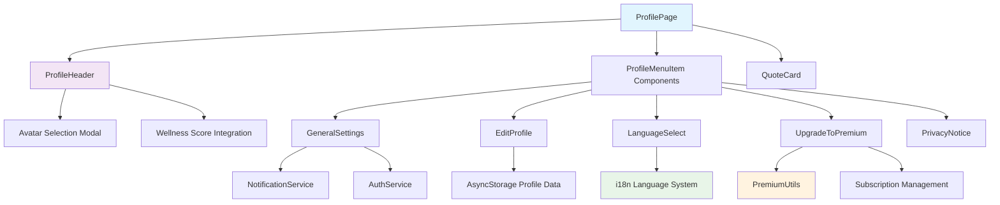
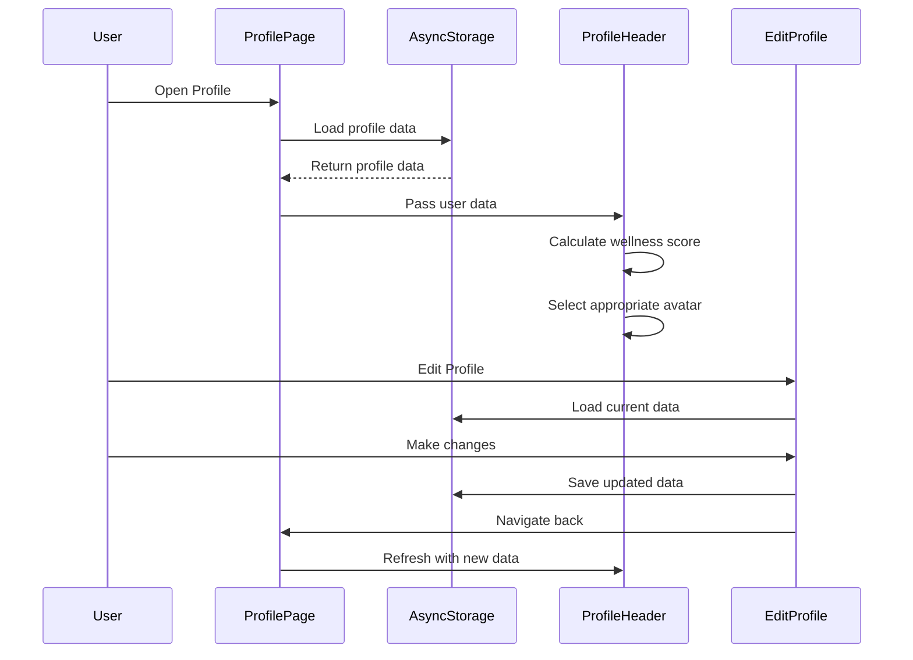
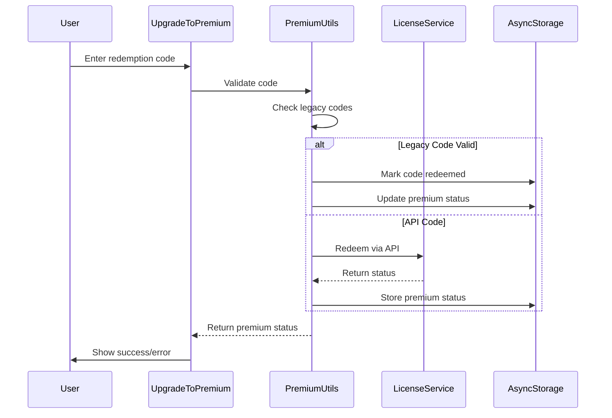

# 🧑‍💼 Profile Screen Documentation

## 📋 Overview

The Profile screen serves as the central hub for user account management and app configuration in the Thought Pro application. It provides access to user settings, premium features, language configuration, and personal profile management through an intuitive menu-driven interface with dynamic avatar representation based on wellness scores.

## 🏗️ Architecture Overview



## 🔧 Core Components

### ProfilePage Component

**Location**: `src/screens/main/ProfilePage.tsx`

```typescript
interface ProfilePageProps {
  navigation: NavigationProp<any>;
}

interface OnboardingProgress {
  self: number;
  child: number;
  total: number;
  completed: number;
  percentage: number;
}
```

**Key Features**:
- **Menu Navigation Hub**: Central access point to all profile-related screens
- **Onboarding Progress Tracking**: Complex calculation system for self and child onboarding completion
- **Premium Status Integration**: Real-time premium tier display and upgrade prompts
- **Daily Quote System**: Rotating motivational quotes with wellness themes

**Core Functionality**:

```typescript
// Onboarding progress calculation
const getOnboardingProgress = useCallback(async (): Promise<OnboardingProgress> => {
  const profileData = await AsyncStorage.getItem('profile');
  const childProfilesData = await AsyncStorage.getItem('childProfiles');
  
  // Self onboarding calculation (14 total steps)
  const selfProgress = calculateSelfProgress(profile);
  
  // Child onboarding calculation (12 steps per child)
  const childProgress = calculateChildProgress(childProfiles);
  
  return {
    self: selfProgress,
    child: childProgress,
    total: 14 + (childProfiles.length * 12),
    completed: selfProgress + childProgress,
    percentage: Math.round(((selfProgress + childProgress) / total) * 100)
  };
}, []);
```

**Menu Structure**:
1. **General Settings** - App configuration and preferences
2. **Edit Profile** - Personal information management
3. **Choose Language** - Internationalization settings
4. **Upgrade to Premium** - Subscription management
5. **Privacy Notice** - Data protection information

### ProfileHeader Component

**Location**: `src/components/ProfileHeader.tsx`

```typescript
interface ProfileHeaderProps {
  userName?: string;
  userScore?: number;
}

interface AvatarSelectionData {
  selectedAvatarId: string;
  avatarOptions: AvatarOption[];
  isModalVisible: boolean;
  wellnessScore: number;
}
```

**Avatar System Features**:

```typescript
// Wellness-based avatar selection
const getAvatarForScore = (score: number, gender: 'male' | 'female'): string => {
  const avatarSets = {
    male: {
      high: 'male_avatar_happy',      // Score 80-100
      medium: 'male_avatar_neutral',  // Score 50-79
      low: 'male_avatar_sad'          // Score 0-49
    },
    female: {
      high: 'female_avatar_happy',    // Score 80-100
      medium: 'female_avatar_neutral', // Score 50-79
      low: 'female_avatar_sad'        // Score 0-49
    }
  };
  
  if (score >= 80) return avatarSets[gender].high;
  if (score >= 50) return avatarSets[gender].medium;
  return avatarSets[gender].low;
};
```

**Key Features**:
- **Dynamic Avatar System**: Automatic avatar changes based on wellness scores
- **Manual Avatar Selection**: Modal interface for user-controlled avatar choice
- **Gender-Specific Avatars**: Separate avatar sets for male and female users
- **Wellness Score Display**: Real-time wellness score integration
- **Avatar Modal Interface**: Grid-based avatar selection with preview

## 🔗 Connected Screens

### 1. GeneralSettings Screen

**Location**: `src/screens/main/GeneralSettings.tsx`

```typescript
interface GeneralSettingsState {
  notificationSettings: {
    pushNotifications: boolean;
    emailNotifications: boolean;
    smsNotifications: boolean;
  };
  accountSettings: {
    twoFactorEnabled: boolean;
    dataSync: boolean;
  };
}
```

**Core Features**:
- **Notification Management**: Toggle controls for push, email, and SMS notifications
- **Account Security**: Two-factor authentication and data sync settings
- **Logout Functionality**: Secure session termination with data cleanup
- **Privacy Controls**: Data sharing and analytics preferences

**Navigation Flow**:
```typescript
// From ProfilePage menu item
<ProfileMenuItem
  icon="settings"
  title={t('profile.menu.generalSettings')}
  onPress={() => navigation.navigate('GeneralSettings')}
  progress={settingsProgress}
/>
```

### 2. EditProfile Screen

**Location**: `src/screens/main/EditProfile.tsx`

```typescript
interface EditProfileData {
  name: string;
  email: string;
  phone: string;
  relation: string;
  gender: 'male' | 'female' | '';
  dateOfBirth: string;
}
```

**Key Features**:
- **Personal Information Editing**: Name, email, phone, and relationship status
- **Gender Selection**: Impacts avatar system behavior
- **Date of Birth Management**: Age-based feature customization
- **AsyncStorage Persistence**: Local data storage with automatic sync
- **Validation System**: Input validation and error handling

**Data Management**:
```typescript
const saveProfile = async (profileData: EditProfileData) => {
  try {
    await AsyncStorage.setItem('profile', JSON.stringify(profileData));
    // Update avatar system based on gender change
    if (profileData.gender !== previousGender) {
      await updateAvatarForGender(profileData.gender);
    }
  } catch (error) {
    console.error('Profile save error:', error);
  }
};
```

### 3. LanguageSelect Screen

**Location**: `src/screens/main/LanguageSelect.tsx`

```typescript
interface LanguageOption {
  code: string;
  name: string;
  nativeName: string;
  flag: string;
}

const SUPPORTED_LANGUAGES: LanguageOption[] = [
  { code: 'en', name: 'English', nativeName: 'English', flag: '🇺🇸' },
  { code: 'hi', name: 'Hindi', nativeName: 'हिन्दी', flag: '🇮🇳' },
  { code: 'es', name: 'Spanish', nativeName: 'Español', flag: '🇪🇸' },
  // Additional languages...
];
```

**Core Features**:
- **Multi-Language Support**: Comprehensive internationalization system
- **Real-Time Language Switching**: Immediate UI language updates
- **Native Language Display**: Both English and native language names
- **Flag Indicators**: Visual language identification
- **Persistent Language Storage**: AsyncStorage-based language preference

**Language Switching Logic**:
```typescript
const changeLanguage = async (languageCode: string) => {
  try {
    await i18n.changeLanguage(languageCode);
    await AsyncStorage.setItem('selectedLanguage', languageCode);
    
    // Navigate back with updated language
    navigation.goBack();
  } catch (error) {
    console.error('Language change error:', error);
  }
};
```

### 4. UpgradeToPremium Screen

**Location**: `src/screens/main/UpgradetoPremiumScreen/UpgradeToPremium.tsx`

```typescript
interface PremiumTier {
  name: 'free' | 'premium' | 'ultra';
  features: string[];
  scanLimit: number;
  price?: string;
}

interface RedemptionStatus {
  isRedeeming: boolean;
  redeemCodeInput: string;
  premiumStatus: PremiumStatus | null;
}
```

**Key Features**:
- **Tier Comparison Table**: Free vs Premium vs Ultra feature comparison
- **Code Redemption System**: Legacy and API-based code redemption
- **Subscription Status Display**: Current plan and expiration information
- **Feature Access Control**: Premium feature gating system

**Premium Benefits Structure**:
```typescript
const PREMIUM_FEATURES = {
  free: {
    scans: 3,
    monitoring: ['Basic stress tracking', 'Limited insights'],
    support: false
  },
  premium: {
    scans: 10,
    monitoring: ['Full parameter tracking', 'Advanced insights', 'Interventions'],
    support: true
  },
  ultra: {
    scans: 100,
    monitoring: ['All premium features', 'Professional sessions'],
    support: true,
    sessions: true
  }
};
```

### 5. Premium Utilities System

**Location**: `src/utils/premiumUtils.ts`

```typescript
interface PremiumStatus {
  isPremium: boolean;
  planType: 'free' | 'premium' | 'ultra';
  redeemedAt?: string;
  expiresAt?: string;
  features: string[];
}

interface LegacyCode {
  code: string;
  type: 'premium' | 'ultra';
  isValid: boolean;
  redeemed: boolean;
}
```

**Core Functionality**:

```typescript
// Legacy code redemption system
const redeemLegacyCode = async (code: string): Promise<PremiumStatus> => {
  const validCodes = await getValidLegacyCodes();
  const codeData = validCodes.find(c => c.code === code && !c.redeemed);
  
  if (!codeData) {
    throw new Error('Invalid or already redeemed code');
  }
  
  // Mark code as redeemed
  await markCodeAsRedeemed(code);
  
  // Update premium status
  const premiumStatus: PremiumStatus = {
    isPremium: true,
    planType: codeData.type,
    redeemedAt: new Date().toISOString(),
    features: getPremiumFeatures(codeData.type)
  };
  
  await AsyncStorage.setItem('premiumStatus', JSON.stringify(premiumStatus));
  return premiumStatus;
};

// API-based code redemption
const redeemApiCode = async (code: string): Promise<PremiumStatus> => {
  const response = await LicenseService.redeemCode(code);
  
  if (response.success) {
    const premiumStatus: PremiumStatus = {
      isPremium: true,
      planType: response.planType,
      redeemedAt: response.redeemedAt,
      expiresAt: response.expiresAt,
      features: response.features
    };
    
    await AsyncStorage.setItem('premiumStatus', JSON.stringify(premiumStatus));
    return premiumStatus;
  }
  
  throw new Error(response.error || 'Redemption failed');
};
```

## 🔄 Data Flow

### Profile Data Management



### Premium Status Flow



## 🎨 UI Components

### ProfileMenuItem Component

```typescript
interface ProfileMenuItemProps {
  icon: string;
  title: string;
  onPress: () => void;
  progress?: number;
  showProgress?: boolean;
  rightComponent?: React.ReactNode;
}
```

**Visual Features**:
- **Icon Integration**: Custom icon system with Material and FontAwesome support
- **Progress Indicators**: Visual completion status for onboarding items
- **Touchable Interface**: Haptic feedback and press animations
- **Customizable Right Component**: Support for additional UI elements

### QuoteCard Component

```typescript
interface QuoteData {
  text: string;
  author: string;
  category: 'wellness' | 'motivation' | 'mindfulness';
}
```

**Features**:
- **Daily Quote Rotation**: Automatic quote updates based on date
- **Category-Based Selection**: Wellness-focused motivational content
- **Localization Support**: Multi-language quote system
- **Elegant Typography**: Custom font and styling integration

## 🔧 Technical Implementation

### AsyncStorage Data Structure

```typescript
// Profile data structure
interface StoredProfileData {
  name: string;
  email: string;
  phone: string;
  relation: string;
  gender: 'male' | 'female' | '';
  dateOfBirth: string;
  selectedAvatarId?: string;
  onboardingProgress: {
    self: number;
    child: number;
  };
  wellnessScore: number;
  lastUpdated: string;
}

// Premium status structure
interface StoredPremiumStatus {
  isPremium: boolean;
  planType: 'free' | 'premium' | 'ultra';
  redeemedAt?: string;
  expiresAt?: string;
  redemptionMethod: 'legacy' | 'api';
  features: string[];
}

// Settings data structure
interface StoredSettings {
  notifications: {
    push: boolean;
    email: boolean;
    sms: boolean;
  };
  language: string;
  theme: 'light' | 'dark';
  dataSync: boolean;
  twoFactorEnabled: boolean;
}
```

### Navigation Integration

```typescript
// Navigation parameter types
type ProfileStackParamList = {
  ProfilePage: undefined;
  GeneralSettings: undefined;
  EditProfile: undefined;
  LanguageSelect: undefined;
  UpgradeToPremium: undefined;
  PrivacyNotice: undefined;
};

// Navigation usage
const navigation = useNavigation<NavigationProp<ProfileStackParamList>>();

// Menu item navigation
const navigateToScreen = (screenName: keyof ProfileStackParamList) => {
  navigation.navigate(screenName);
};
```

## 🔐 Security & Privacy

### Data Protection Measures

1. **Local Data Encryption**: Sensitive profile data encrypted in AsyncStorage
2. **Premium Code Security**: Server-side validation for redemption codes
3. **Authentication Integration**: Secure logout with session cleanup
4. **Privacy Controls**: User-controlled data sharing preferences

### Privacy Implementation

```typescript
const handleLogout = async () => {
  try {
    // Clear sensitive data
    await AsyncStorage.multiRemove([
      'authToken',
      'premiumStatus',
      'userSession'
    ]);
    
    // Clear navigation stack
    navigation.reset({
      index: 0,
      routes: [{ name: 'LoginScreen' }],
    });
    
    // Clear premium status
    await clearPremiumStatus();
    
  } catch (error) {
    console.error('Logout error:', error);
  }
};
```

## 🌐 Internationalization

### Language System Integration

```typescript
// Supported languages with profile integration
const PROFILE_LANGUAGE_KEYS = {
  'profile.menu.generalSettings': 'General Settings',
  'profile.menu.editProfile': 'Edit Profile',
  'profile.menu.chooseLanguage': 'Choose Language',
  'profile.menu.upgradePremium': 'Upgrade to Premium',
  'profile.avatar.selectAvatar': 'Select Avatar',
  'profile.onboarding.progress': 'Onboarding Progress',
  'profile.premium.status': 'Premium Status',
  'profile.settings.notifications': 'Notifications',
  'profile.settings.privacy': 'Privacy Settings'
};

// Dynamic language switching
const updateLanguage = async (languageCode: string) => {
  await i18n.changeLanguage(languageCode);
  await AsyncStorage.setItem('selectedLanguage', languageCode);
  
  // Force re-render of profile components
  forceUpdate();
};
```

## 📊 Analytics & Monitoring

### User Interaction Tracking

```typescript
// Profile screen analytics
const trackProfileInteraction = (action: string, metadata?: object) => {
  Analytics.track('Profile_Interaction', {
    action,
    screen: 'ProfilePage',
    timestamp: new Date().toISOString(),
    ...metadata
  });
};

// Usage examples
trackProfileInteraction('avatar_changed', { newAvatarId, wellnessScore });
trackProfileInteraction('premium_upgrade_attempted', { upgradeType });
trackProfileInteraction('language_changed', { fromLanguage, toLanguage });
```

## 🚀 Performance Optimizations

### Component Optimization

```typescript
// Memoized onboarding progress calculation
const onboardingProgress = useMemo(() => {
  return calculateOnboardingProgress(profileData, childProfiles);
}, [profileData, childProfiles]);

// Optimized avatar selection
const optimizedAvatarComponent = React.memo(({ score, gender, selectedId }) => {
  const avatarSource = useMemo(() => {
    return getAvatarForScore(score, gender, selectedId);
  }, [score, gender, selectedId]);
  
  return <Avatar source={avatarSource} />;
});

// Debounced profile updates
const debouncedProfileUpdate = useCallback(
  debounce(async (newProfileData) => {
    await AsyncStorage.setItem('profile', JSON.stringify(newProfileData));
  }, 500),
  []
);
```

## 🔄 Error Handling

### Comprehensive Error Management

```typescript
// Profile data error handling
const handleProfileError = (error: Error, context: string) => {
  console.error(`Profile error in ${context}:`, error);
  
  // Show user-friendly error message
  Alert.alert(
    t('error.profile.title', 'Profile Error'),
    t('error.profile.message', 'Unable to update profile. Please try again.'),
    [
      { text: t('common.ok', 'OK'), style: 'default' }
    ]
  );
  
  // Track error for analytics
  Analytics.trackError('ProfileError', {
    context,
    error: error.message,
    stack: error.stack
  });
};

// Premium redemption error handling
const handleRedemptionError = (error: Error) => {
  let errorMessage = t('upgrade.error.general', 'Redemption failed');
  
  if (error.message.includes('invalid')) {
    errorMessage = t('upgrade.error.invalidCode', 'Invalid redemption code');
  } else if (error.message.includes('expired')) {
    errorMessage = t('upgrade.error.expiredCode', 'Redemption code has expired');
  } else if (error.message.includes('used')) {
    errorMessage = t('upgrade.error.usedCode', 'Redemption code already used');
  }
  
  Alert.alert(
    t('upgrade.error.title', 'Redemption Error'),
    errorMessage,
    [{ text: t('common.ok', 'OK') }]
  );
};
```

## 📱 Platform-Specific Implementations

### iOS-Specific Features

```typescript
// iOS haptic feedback for profile interactions
import { HapticFeedback } from 'react-native-haptic-feedback';

const handleMenuItemPress = (action: () => void) => {
  if (Platform.OS === 'ios') {
    HapticFeedback.trigger('selection');
  }
  action();
};

// iOS-specific avatar animation
const avatarTransition = {
  duration: 300,
  easing: Easing.out(Easing.cubic),
  useNativeDriver: true
};
```

### Android-Specific Features

```typescript
// Android back button handling
useEffect(() => {
  const backAction = () => {
    if (isAvatarModalVisible) {
      setIsAvatarModalVisible(false);
      return true;
    }
    return false;
  };

  const backHandler = BackHandler.addEventListener('hardwareBackPress', backAction);
  return () => backHandler.remove();
}, [isAvatarModalVisible]);
```

## 🧪 Testing Considerations

### Unit Testing Structure

```typescript
// Profile component tests
describe('ProfilePage', () => {
  test('should calculate onboarding progress correctly', () => {
    const mockProfileData = { /* profile data */ };
    const mockChildProfiles = [ /* child profiles */ ];
    
    const progress = calculateOnboardingProgress(mockProfileData, mockChildProfiles);
    
    expect(progress.percentage).toBe(75);
    expect(progress.completed).toBe(21);
    expect(progress.total).toBe(28);
  });
  
  test('should handle premium code redemption', async () => {
    const mockCode = 'PREMIUM123';
    const result = await redeemLegacyCode(mockCode);
    
    expect(result.isPremium).toBe(true);
    expect(result.planType).toBe('premium');
  });
});

// Avatar system tests
describe('AvatarSystem', () => {
  test('should select correct avatar for wellness score', () => {
    expect(getAvatarForScore(85, 'male')).toBe('male_avatar_happy');
    expect(getAvatarForScore(60, 'female')).toBe('female_avatar_neutral');
    expect(getAvatarForScore(30, 'male')).toBe('male_avatar_sad');
  });
});
```

## 📈 Future Enhancements

### Planned Features

1. **Social Profile Integration**: Connect with friends and family members
2. **Achievement System**: Onboarding and wellness milestones with badges
3. **Profile Themes**: Customizable color schemes and layouts
4. **Advanced Avatar System**: AI-generated personalized avatars
5. **Profile Analytics**: Personal usage statistics and trends
6. **Cloud Sync**: Cross-device profile synchronization
7. **Profile Sharing**: Export profile summaries and progress reports

### Technical Improvements

1. **State Management**: Migration to Redux Toolkit for complex state
2. **Offline Support**: Enhanced offline profile editing capabilities
3. **Performance**: Lazy loading for profile components
4. **Accessibility**: Enhanced screen reader and keyboard navigation support
5. **Security**: Biometric authentication for profile access

---

*This documentation provides a comprehensive overview of the Profile screen ecosystem, covering all connected components, data flows, and integration patterns within the Thought Pro application.*
