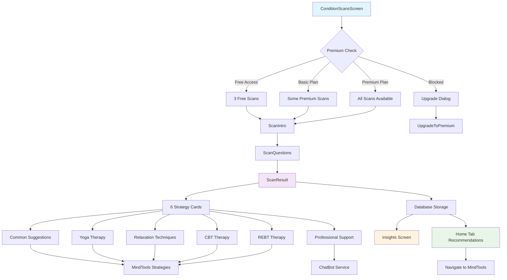

# 🩺 Conditions Scan End-to-End Flow Documentation

## 📋 Overview

The Conditions Scan system provides comprehensive mental health assessment through a structured flow: **Scan Selection** → **Introduction** → **Questions** → **Results** → **Strategy Recommendations** → **MindTools Integration**. This system integrates with the app's subscription model, insights tracking, and intervention management.

## 🏗️ Complete Flow Architecture



## 🔧 Subscription-Based Scan Access

### Scan Tier Structure

**Location**: `src/screens/main/conditionsScan/ConditionScansScreen.tsx`

```typescript
type Plan = "free" | "basic" | "premium";

// FREE TIER (3 scans available)
const freeScans = [
  "Anger Management",
  "Stress", 
  "Internet and Social Media Issue"
];

// BASIC TIER (additional scans)
const basicScans = [
  "Family and Relationship",
  "Sleep",
  "Suicidal Behaviour", 
  "Sex Life"
];

// PREMIUM TIER (all remaining scans)
const premiumScans = [
  "Addictions",
  "Common Psychological Issues",
  "Environment Issues Affecting Mental Wellbeing",
  "Financial Mental Health",
  "General Physical Fitness",
  "Internet Dependence",
  "Professional Mental Health",
  "Social Mental Health",
  "Youngster Issues",
  "Job Insecurity"
];
```

### Access Control Implementation

```typescript
const handleItemPress = async ({ name, nameKey }: ScanPressParams) => {
  const scan = allScans.find((s) => s.name === name && s.nameKey === nameKey);
  if (!scan) return;
  
  const canAccess = await canAccessFeature(scan.requiredPlan);
  
  if (canAccess) {
    navigation.navigate("ScanIntro", { scanName: scan.name });
  } else {
    setBlockedPlan(scan.requiredPlan);
    setDialogVisible(true); // Show upgrade popup
  }
};
```

### Upgrade Dialog Flow

When users try to access blocked scans:

```typescript
// Upgrade Dialog Modal
<Modal visible={dialogVisible} transparent animationType="fade">
  <View style={styles.modalOverlay}>
    <View style={styles.dialog}>
      <Text style={styles.dialogTitle}>
        {t(`conditionScans.upgradeDialog.${blockedPlan}.title`)}
      </Text>
      <Text style={styles.dialogText}>
        {t(`conditionScans.upgradeDialog.${blockedPlan}.message`)}
      </Text>
      <View style={styles.dialogActions}>
        <TouchableOpacity onPress={() => setDialogVisible(false)}>
          <Text style={styles.cancelButton}>Cancel</Text>
        </TouchableOpacity>
        <TouchableOpacity 
          onPress={() => {
            setDialogVisible(false);
            navigation.navigate("UpgradeToPremium");
          }}
        >
          <Text style={styles.upgradeButtonLabel}>Upgrade</Text>
        </TouchableOpacity>
      </View>
    </View>
  </View>
</Modal>
```

## 📊 Scan Introduction & Question Flow

### ScanIntro Screen

**Location**: `src/screens/main/conditionsScan/ScanIntro.tsx`

**Key Features**:
- **Dynamic Content**: Translated scan descriptions based on condition type
- **Scan Metadata**: Shows question count and estimated time
- **Question Screen Mapping**: Routes to appropriate question set

```typescript
interface ScanIntroData {
  name: string;
  title: string; // Translated title
  overview: string; // Translated overview
  questionScreen: string; // Maps to question set
}

// Question screen mapping
const scanData = [
  { name: "Addictions", questionScreen: "addictionsQuestion" },
  { name: "Anger Management", questionScreen: "angerManagementQuestion" },
  { name: "Stress", questionScreen: "stressQuestion" },
  // ... all 17 conditions mapped
];
```

### ScanQuestions Screen

**Location**: `src/screens/main/conditionsScan/ScanQuestions.tsx`

**Question System**:
- **10 questions per scan** with 5-point Likert scale
- **Real-time progress tracking** with visual progress bar
- **Multi-language support** with dynamic translation
- **Answer persistence** using AsyncStorage

```typescript
interface QuestionOption {
  Q_id: string;
  Name: string; // Question text
  "Option 1": string; // Strongly Disagree
  "Option 1 Weight": string; // Score: 1
  "Option 2": string; // Disagree  
  "Option 2 Weight": string; // Score: 2
  "Option 3": string; // Neutral
  "Option 3 Weight": string; // Score: 3
  "Option 4": string; // Agree
  "Option 4 Weight": string; // Score: 4
  "Option 5": string; // Strongly Agree
  "Option 5 Weight": string; // Score: 5
}
```

## 📈 Scoring System & Result Categories

### Score Range Categories

**Location**: `src/screens/main/conditionsScan/ScanResult.tsx`

```typescript
interface ScoreCategory {
  range: [number, number];
  label: string;
  description: string;
  recommendedStrategies: number[]; // Strategy card indices
}

const scoreCategories = {
  normal: {
    range: [0, 25],
    label: "Normal",
    description: "Low risk condition",
    recommendedStrategies: [0] // Common Suggestions only
  },
  lowRisk: {
    range: [26, 49], 
    label: "Low Risk",
    description: "Mild symptoms present",
    recommendedStrategies: [0, 1, 2] // Common, Yoga, Relaxation
  },
  moderateRisk: {
    range: [50, 75],
    label: "Moderate Risk", 
    description: "Moderate intervention needed",
    recommendedStrategies: [3, 4, 5] // CBT, REBT, Professional
  },
  severeRisk: {
    range: [76, 100],
    label: "Severe Risk",
    description: "Immediate professional help recommended", 
    recommendedStrategies: [3, 4, 5] // CBT, REBT, Professional
  }
};
```

### Result Storage & Tracking

```typescript
// Database storage
const saveResult = async () => {
  if (scanName && totalScore) {
    await saveScanResultBasic(scanName, totalScore);
    console.log('Scan result saved to database');
  }
};

// Data structure saved
interface ScanResult {
  scan_title: string;
  total_score: number;
  scan_date: string;
  scan_time: string;
  result?: string;
}
```

## 🎯 Strategy Recommendation System

### 6 Strategy Cards Based on Score

**Location**: `src/components/RecommendedInterventions.tsx`

```typescript
interface StrategyCard {
  id: string;
  title: string;
  description: string;
  isRecommended: boolean; // Based on score range
  navigationTarget: string;
}

const strategyCards = [
  {
    id: "1",
    title: "Common Suggestions",
    description: "General wellness tips and lifestyle changes",
    scoreRange: [0, 49], // Recommended for low scores
    navigationTarget: "CommonSuggestionsScreen"
  },
  {
    id: "2", 
    title: "Yoga Therapy",
    description: "Mindful movement and breathing exercises",
    scoreRange: [26, 49],
    navigationTarget: "YogaScreen"
  },
  {
    id: "3",
    title: "Relaxation Techniques", 
    description: "Stress reduction and calming practices",
    scoreRange: [26, 49],
    navigationTarget: "RelaxationScreen"
  },
  {
    id: "4",
    title: "CBT (Cognitive Behavioral Therapy)",
    description: "Thought pattern recognition and modification",
    scoreRange: [50, 100],
    navigationTarget: "CBTScreen"
  },
  {
    id: "5",
    title: "REBT (Rational Emotive Behavior Therapy)",
    description: "Emotional regulation and rational thinking",
    scoreRange: [50, 100], 
    navigationTarget: "REBTScreen"
  },
  {
    id: "6",
    title: "Professional Mental Health Support",
    description: "Connect with licensed mental health professionals",
    scoreRange: [50, 100],
    navigationTarget: "ChatbotService" // Professional booking system
  }
];
```

### Strategy Navigation Logic

```typescript
const navigateToStrategy = (strategyType: string) => {
  const condition = getConditionSlug(scanName || "");
  
  switch (strategyType) {
    case "common":
      navigation.navigate("CommonSuggestionsScreen", { condition });
      break;
    case "yoga":
      navigation.navigate("YogaScreen", { condition });
      break;
    case "relaxation":
      navigation.navigate("RelaxationScreen", { condition });
      break;
    case "cbt":
      navigation.navigate("CBTScreen", { condition });
      break;
    case "rebt":
      navigation.navigate("REBTScreen", { condition });
      break;
    case "professional":
      // Navigate to professional booking system
      navigation.navigate("ProfessionalSupport", { condition });
      break;
  }
};
```

## 🧠 MindTools Integration

### Condition Slug Mapping

```typescript
// Maps scan names to MindTools condition screens
const conditionMappings: Record<string, string> = {
  "Anger Management": "anger-management",
  "Stress": "stress",
  "Internet and Social Media Issue": "internet-social-media", 
  "Family and Relationship": "family-relationship",
  "Sleep": "sleep",
  "Suicidal Behaviour": "suicidal-behaviour",
  "Sex Life": "sex-life",
  "Addictions": "addictions",
  "Common Psychological Issues": "common-psychological-issues",
  "Environment Issues Affecting Mental Wellbeing": "environment-issues",
  "Financial Mental Health": "financial-mental-health",
  "General Physical Fitness": "general-physical-fitness",
  "Internet Dependence": "internet-dependence",
  "Professional Mental Health": "professional-mental-health", 
  "Social Mental Health": "social-mental-health",
  "Youngster Issues": "youngster-issues",
  "Job Insecurity": "job-insecurity"
};
```

### Intervention Card Addition

Users can add intervention strategies to their personal intervention list:

```typescript
// When user selects a strategy card
const addToInterventions = async (intervention: InterventionCard) => {
  const interventionData = {
    id: generateId(),
    title: intervention.title,
    subtitle: intervention.description,
    condition: scanName,
    conditionName: scanName,
    tags: [scanName],
    xp: 50, // XP reward for completion
    date: new Date().toISOString(),
    isSelected: false,
    isCompleted: false
  };
  
  // Add to appropriate intervention tab based on frequency
  await AsyncStorage.setItem(
    `interventions_${intervention.frequency}`,
    JSON.stringify([...existingInterventions, interventionData])
  );
};
```

## 📊 Insights Screen Integration

### Historical Data Display

**Location**: `src/screens/main/Insights/index.tsx`

```typescript
interface InsightsScanData {
  scanTitle: string;
  date: string;
  score: number;
  tiers: string[];
}

// Load all scan results from database
useEffect(() => {
  const loadInsights = async () => {
    const rows = await getAllScanResults();
    const mapped: InsightsScanData[] = rows.map((r) => ({
      scanTitle: r.scan_title,
      date: r.scan_date,
      score: Number(r.total_score),
      tiers: r.result ? r.result.split(",").map(t => t.trim()) : []
    }));
    
    // Sort chronologically
    mapped.sort((a, b) => 
      new Date(a.date).getTime() - new Date(b.date).getTime()
    );
    
    setAllResults(mapped);
  };
  
  loadInsights();
}, []);
```

### Score Band Classification

```typescript
type ScoreBand = "Normal" | "Low Risk" | "Moderate Risk" | "Severe Risk";

const scoreBand = (score: number): ScoreBand =>
  score <= 25 ? "Normal" :
  score <= 50 ? "Low Risk" :
  score <= 75 ? "Moderate Risk" : "Severe Risk";
```

### Comparative Analysis Features

- **Filter by Scan Type**: Compare results within same condition
- **Filter by Score Band**: View all scans within risk category  
- **Filter by Date Range**: Monthly/yearly comparisons
- **Chart Visualization**: Line charts showing score progression over time

```typescript
// Chart data processing for single condition
const filteredScans = allResults.filter(scan => 
  (!scanFilter || scan.scanTitle === scanFilter) &&
  (!scoreFilter || scoreBand(scan.score) === scoreFilter) &&
  (!dateFilter || matchesDateFilter(scan.date, dateFilter))
);

// Paginated chart display (4 data points per page)
const { pagedLabels, pagedData, totalPages } = useMemo(() => {
  const total = chartLabels.length;
  const pages = Math.max(1, Math.ceil(total / PAGE_SIZE));
  const start = page * PAGE_SIZE;
  const end = Math.min(start + PAGE_SIZE, total);
  
  return {
    pagedLabels: chartLabels.slice(start, end),
    pagedData: chartData.slice(start, end),
    totalPages: pages
  };
}, [chartLabels, chartData, page]);
```

## 🏠 Home Tab Recommendations

### Scan Result Integration

**Location**: `src/screens/main/homeTab/index.tsx`

```typescript
// Load recent scan results for recommendations
useEffect(() => {
  const fetchInterventions = async () => {
    const data = await interventionObject(); // Gets all scan results
    
    // Filter and sort to get latest result per scan type
    const latestInterventionsMap = new Map();
    
    data.sort((a, b) => {
      const dateA = new Date(`${a.scan_date} ${a.scan_time}`);
      const dateB = new Date(`${b.scan_date} ${b.scan_time}`);
      return dateA.getTime() - dateB.getTime();
    }).forEach(intervention => {
      latestInterventionsMap.set(intervention.scan_title, intervention);
    });
    
    setInterventionsList(Array.from(latestInterventionsMap.values()));
  };
  
  fetchInterventions();
}, []);
```

### Navigation to MindTools

```typescript
// When user taps on recommended intervention card
const handleScanSelect = (scanId: string) => {
  const selected = interventionsList.find(item => item.id === scanId);
  if (!selected) return;
  
  // Direct navigation to specific condition screen in MindTools
  const screenMapping = {
    "Addictions": "AddictionsScreen",
    "Anger Management": "AngerManagementScreen",
    "Stress": "StressScreen",
    // ... all conditions mapped to specific screens
  };
  
  const targetScreen = screenMapping[selected.scan_title];
  if (targetScreen) {
    navigation.navigate(targetScreen, { 
      condition: selected.scan_title,
      fromScan: true // Flag to indicate origin
    });
  }
};
```

## 👨‍⚕️ Professional Mental Health Support

### Chatbot Integration

**Location**: `src/services/chatbotService.ts`

```typescript
interface Psychologist {
  id: string;
  Name: string;
  Degree: string;
  Languages: string[];
  PsychologistType: string;
  experience: number;
  speciality: string[];
  rating: number;
  price20min: number;
  price45min: number;
  available: boolean;
  nextAvailableSlot: string;
}

interface BookingData {
  psychologistId: string;
  userId: string;
  duration: "20min" | "45min";
  slot: string;
  price: number;
  paymentStatus: "pending" | "completed" | "failed";
}
```

### Professional Booking Flow

```typescript
// When user selects "Professional Support" strategy
const handleProfessionalSupport = async () => {
  // Check user's subscription tier
  const premiumStatus = await getPremiumStatus();
  
  if (premiumStatus.planType === 'ultra') {
    // Ultra users get priority booking
    navigation.navigate('ProfessionalBooking', {
      priority: true,
      condition: scanName
    });
  } else if (premiumStatus.isPremium) {
    // Premium users can book with standard access
    navigation.navigate('ProfessionalBooking', {
      priority: false,
      condition: scanName
    });
  } else {
    // Free users see upgrade prompt
    showUpgradeDialog('professional');
  }
};
```

## 💾 Data Persistence & Storage

### Database Schema

**Location**: `src/services/database.ts`

```sql
CREATE TABLE scan_answers (
  id INTEGER PRIMARY KEY AUTOINCREMENT,
  scan_title TEXT NOT NULL,
  answer1_score TEXT,
  answer2_score TEXT,
  answer3_score TEXT,
  answer4_score TEXT,
  answer5_score TEXT,
  answer6_score TEXT,
  answer7_score TEXT,
  answer8_score TEXT,
  answer9_score TEXT,
  answer10_score TEXT,
  total_score TEXT NOT NULL,
  result TEXT,
  pair_index INTEGER,
  scan_date TEXT NOT NULL,
  scan_time TEXT NOT NULL,
  question1 TEXT,
  question2 TEXT,
  question3 TEXT,
  question4 TEXT,
  question5 TEXT,
  question6 TEXT,
  question7 TEXT,
  question8 TEXT,
  question9 TEXT,
  question10 TEXT,
  interventions TEXT,
  created_at DATETIME DEFAULT CURRENT_TIMESTAMP
);
```

### AsyncStorage Integration

```typescript
// Intervention storage by frequency
interface StoredIntervention {
  id: string;
  title: string;
  subtitle: string;
  condition: string;
  conditionName: string;
  tags: string[];
  xp: number;
  date: string;
  isSelected: boolean;
  isCompleted: boolean;
}

// Storage keys by intervention frequency
const INTERVENTION_KEYS = {
  daily: 'interventions_Daily',
  weekly: 'interventions_Weekly', 
  biweekly: 'interventions_Bi-weekly',
  monthly: 'interventions_Monthly'
};
```

## 🔄 Complete User Journey

### End-to-End Flow Example

1. **User accesses Conditions Scan**:
   ```typescript
   // User navigates to ConditionScansScreen
   navigation.navigate('ConditionScansScreen');
   ```

2. **Subscription check**:
   ```typescript
   // System checks user's plan tier
   const canAccess = await canAccessFeature(scan.requiredPlan);
   ```

3. **Scan introduction**:
   ```typescript
   // If access granted, show scan overview
   navigation.navigate('ScanIntro', { scanName: 'Stress' });
   ```

4. **Question completion**:
   ```typescript
   // User answers 10 questions, system calculates score
   const totalScore = answers.reduce((sum, answer) => sum + answer.weight, 0);
   ```

5. **Result display**:
   ```typescript
   // Show score, category, and recommended strategies
   navigation.navigate('ScanResult', { 
     scanName: 'Stress', 
     totalScore: 67,
     category: 'Moderate Risk'
   });
   ```

6. **Strategy selection**:
   ```typescript
   // User selects CBT strategy (score 67 = moderate risk)
   navigation.navigate('CBTScreen', { 
     condition: 'stress',
     fromScan: true 
   });
   ```

7. **Add to interventions**:
   ```typescript
   // User adds CBT exercises to weekly interventions
   await addInterventionToList('Weekly', cbtIntervention);
   ```

8. **Data storage**:
   ```typescript
   // System saves scan result to database
   await saveScanResultBasic('Stress', 67);
   ```

9. **Home tab display**:
   ```typescript
   // Latest scan appears in recommended interventions
   setInterventionsList([...previousScans, newStressScan]);
   ```

10. **Insights tracking**:
    ```typescript
    // User can view progress in Insights screen
    const stressHistory = await getScanResultsHistoryByTitle('Stress');
    ```

## 🎨 UI/UX Features

### Visual Score Indicators

```typescript
// Color coding based on score ranges
const getScoreColor = (score: number): string => {
  if (score <= 25) return '#4CAF50'; // Green - Normal
  if (score <= 50) return '#FF9800'; // Orange - Low Risk  
  if (score <= 75) return '#FF5722'; // Red Orange - Moderate Risk
  return '#F44336'; // Red - Severe Risk
};

// Progress bar visual representation
<View style={[styles.progressBar, { backgroundColor: getScoreColor(score) }]}>
  <Text style={styles.scoreText}>{score}/100</Text>
</View>
```

### Recommended Strategy Badges

```typescript
// Visual indicators for recommended strategies
{item.isRecommended && (
  <View style={styles.recommendedBadge}>
    <Text style={styles.recommendedText}>
      {t("scanResult.strategies.recommended")}
    </Text>
  </View>
)}
```

## 🔒 Security & Privacy

### Data Encryption

```typescript
// Sensitive scan data is encrypted before storage
const encryptScanData = (scanData: ScanResult): string => {
  return CryptoJS.AES.encrypt(
    JSON.stringify(scanData), 
    ENCRYPTION_KEY
  ).toString();
};
```

### Access Control

```typescript
// Premium feature gating
const canAccessFeature = async (requiredPlan: Plan): Promise<boolean> => {
  const userPlan = await getCurrentUserPlan();
  
  const planHierarchy = { free: 0, basic: 1, premium: 2 };
  return planHierarchy[userPlan] >= planHierarchy[requiredPlan];
};
```

## 📊 Analytics Integration

### Usage Tracking

```typescript
// Track scan completion events
const trackScanCompletion = (scanName: string, score: number) => {
  Analytics.track('Scan_Completed', {
    scan_type: scanName,
    score: score,
    score_category: scoreBand(score),
    completion_time: Date.now(),
    user_plan: userPlan
  });
};

// Track strategy selection
const trackStrategySelection = (strategy: string, fromScore: number) => {
  Analytics.track('Strategy_Selected', {
    strategy_type: strategy,
    scan_score: fromScore,
    is_recommended: isRecommendedForScore(strategy, fromScore)
  });
};
```

This documentation covers the complete end-to-end conditions scan flow as implemented in the Thought Pro application, including all subscription tiers, scoring mechanisms, strategy recommendations, MindTools integration, and data persistence patterns.

---

*This documentation reflects the actual implementation in the codebase and includes only features that are currently built and functional.*
